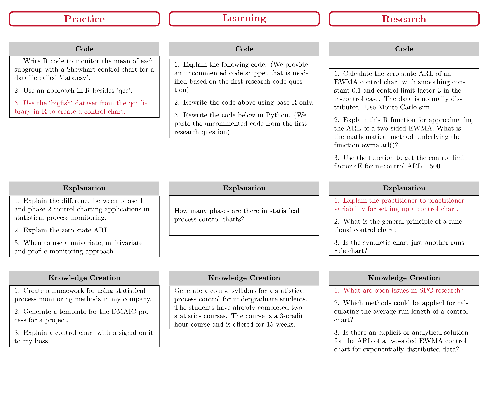
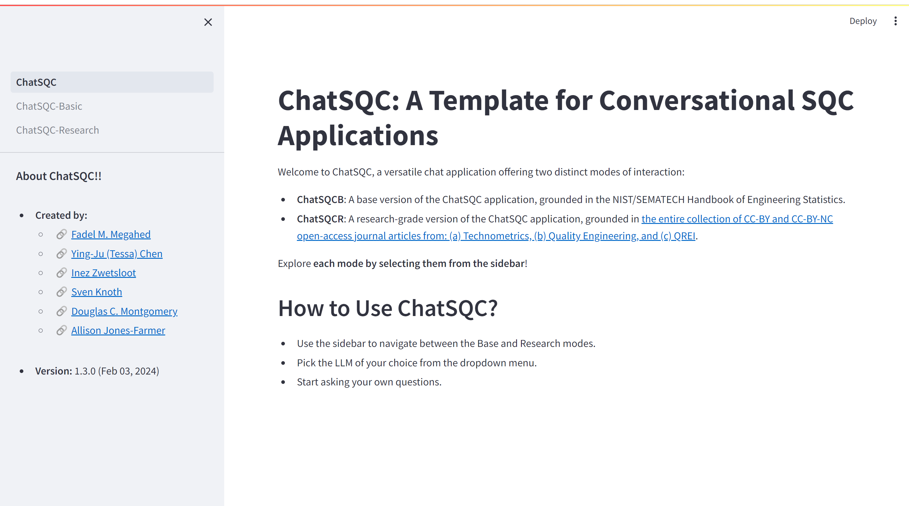

```{r setup, include=FALSE}
knitr::opts_chunk$set(cache = TRUE,
                      echo = FALSE,
                      warning = FALSE,
                      message = FALSE,
                      progress = FALSE, 
                      verbose = FALSE,
                      dev = 'png',
                      fig.height = 3,
                      dpi = 300,
                      fig.align = 'center')

options(htmltools.dir.version = FALSE)


if(require(pacman)==FALSE) install.packages("pacman")
if(require(devtools)==FALSE) install.packages("devtools")
if(require(countdown)==FALSE) devtools::install_github("gadenbuie/countdown")
if(require(xaringanExtra)==FALSE) devtools::install_github("gadenbuie/xaringanExtra")
if(require(emo)==FALSE) devtools::install_github("hadley/emo")
if(require(icons)==FALSE) devtools::install_github("mitchelloharawild/icons")

pacman::p_load(tidyverse, magrittr, lubridate, janitor, # data analysis pkgs
               DataExplorer, scales, plotly, calendR, pdftools, # plots
               tmap, sf, urbnmapr, tigris, # maps
               bibliometrix, # for bibliometric analysis of my papers
               gifski, av, gganimate, ggtext, glue, extrafont, # for animations
               emojifont, emo, RefManageR, xaringanExtra, countdown) # for
```

```{r xaringan-themer, include=FALSE, warning=FALSE}
if(require(xaringanthemer) == FALSE) install.packages("xaringanthemer")
library(xaringanthemer)

style_mono_accent(base_color = "#84d6d3",
                  base_font_size = "20px")

xaringanExtra::use_extra_styles(
  hover_code_line = TRUE,         
  mute_unhighlighted_code = TRUE  
)

xaringanExtra::use_xaringan_extra(c("tile_view", "animate_css", "tachyons", "panelset", "share_again", "search", "fit_screen", "editable", "clipboard"))

```


# Background: Artificial Intelligence


.left-code[

.center[.bold[A [working definition](https://www.brookings.edu/articles/what-is-artificial-intelligence/) for AI]]

.content-box-gray[
.bold[.red[Artificial Intelligence (AI):]] .bold[A system that acts in a way, where people might denote as "intelligent" if another human were to do something similar.]
]

.center[.bold[Reported applications of AI span numerous fields]] 
e.g., see a sample applications as generated by ChatGPT in the flowchart to the right.

]

.right-plot[
```{r tex_to_png, out.width='100%', dpi=600, include=FALSE}
pdftools::pdf_convert('figs/ai_applications.pdf', dpi = 600,
                      filenames = 'figs/ai_applications.png')
pdftools::pdf_convert('figs/generative_ai_chart.pdf', dpi = 600,
                      filenames = 'figs/generative_ai_chart.png')
pdftools::pdf_convert('figs/conclusions.pdf', dpi = 600,
                      filenames = 'figs/conclusions.png')
pdftools::pdf_convert('figs/open_questions.pdf', dpi = 600,
                      filenames = 'figs/open_questions.png')
```
```{r ai_apps_out, out.width='100%', dpi = 600, fig.alt='A flowchart highlighting the applications of AI, with highlight in red for fraud detection (in e-commerce), grading and assessment (in education), quality control and predictive maintenance (in manufacturing and production) as they relate the most to our SPC audience'}
knitr::include_graphics('figs/ai_applications.png')
```

]

.footnote[
<html>
<hr>
</html>

**Image Source:** The flowchart's content and its LaTex code were generated using ChatGPT (May 24 Version).
]

---

# Background: Generative AI

.content-box-gray[
.bold[.red[Generative AI:]] .bold[The objective is to generate new content rather than analyze existing data.]
]

.font90[
-  The generated content is based on a .bold[.red[stochastic behavior embedded in generative AI models such that the same input prompts results in different content]].
- State-of-the-art generative AI models can have up to **540 billion parameters** ([PaLM](https://arxiv.org/abs/2204.02311)).  
- With the increase in model size, researchers have observed the **“emergent abilities”** of LLMs, which were **not explicitly encoded in the training**. [Examples include](https://ai.googleblog.com/2022/11/characterizing-emergent-phenomena-in.html):
  + Multi-step arithmetic,   
  + taking college-level exams, and 
  + identifying the intended meaning of a word.  
- LLMs are **foundation models** (see [Bommasani et al. 2021](https://arxiv.org/abs/2108.07258)), large pre-trained AI systems
that can be **repurposed with minimal effort across numerous domains and diverse tasks.**
]


---

# Background: Generative AI Developments

```{r generative_ai_dev_out, echo=FALSE, out.width='100%'}
knitr::include_graphics('figs/ai_dev.png')
```


---

# Background: Generative AI Hype

```{r gen_ai_hype, out.width='100%', fig.height = 3.5, dpi = 600, echo=FALSE, fig.alt='It took ChatGPT 5 days to reach 1 million users, while Instagram took 2.5 months and twitter took 24 months. We have not seen such a huge adoption that quick in tech before.'}

knitr::include_graphics('figs/chatgpt_hype.png')

```


---


# Background: Generative AI Hype

```{r mckinsey_ai, echo=FALSE, out.width='60%'}
knitr::include_graphics('figs/mckinsey_ai.png')
```

.footnote[
<html>
<hr>
</html>

**Image Source:** [McKinsey & Company (July 2023). The economic potential of generative AI: The next productivity frontier [P. 10]](https://www.mckinsey.com/~/media/mckinsey/business%20functions/mckinsey%20digital/our%20insights/the%20economic%20potential%20of%20generative%20ai%20the%20next%20productivity%20frontier/the-economic-potential-of-generative-ai-the-next-productivity-frontier-vf.pdf)
]


---
class: inverse, center, middle

# On the Use of LLMs, such as ChatGPT, in SQC

<br>

.pull-left-2[<br> Megahed, F. M., Chen, Y. J., Ferris, J. A., Knoth, S., & Jones-Farmer, L. A. (2023). How generative AI models such as ChatGPT can be (mis)used in SPC practice, education, and research? An exploratory study. *Quality Engineering*, 1-29.

[Available @ [QE](https://www.tandfonline.com/doi/full/10.1080/08982112.2023.2206479) & [arXiv](https://arxiv.org/pdf/2302.10916.pdf)].]

.pull-right-2[<div></div>]


---

# Our Overarching Research Question

.content-box-red[
.bold[What can generative LLM-based AI tools do now to augment the roles of SPC practitioners, educators, and researchers?]

]

-  **Secondary goal:** To motivate the SPC community to be receptive to exploring whether new AI tools can help them be more **efficient**, **productive**, and **innovative**. This is consistent with:

  + Box and Woodall ([2012](https://www.tandfonline.com/doi/10.1080/08982112.2012.627003)): “we stress the necessity for the quality engineering community to strengthen and promote its role in **innovation**”, and  
  + Hockman and Jensen ([2016](https://www.tandfonline.com/doi/10.1080/08982112.2015.1083107)): “for statisticians to be successful in leading innovation, they will need to strengthen their **skills beyond what they have traditionally needed in the past**, but we believe this will be worth the effort”.  
  
- **Scope:** We evaluated the utility of ChatGPT (GPT-3.5 engine) as of its *Jan 30 Version*.   

---

# Our Study Design

```{r study_design, include=FALSE}
pdftools::pdf_convert('figs/methods.pdf', dpi = 580,
                      filenames = 'figs/methods.png') # convert latex pdf to png
```

```{r, echo=FALSE, out.width="68%"}

# An overview of our study design, where we focused on three applications code, explanation, and knowledge generation for each application domain of practice, learning, and research. Red color is used to highlight the questions that will be discussed in the presentation.
```


---

# The Good: Knowledge Generation


.bold[Inspired by the TEDxBoston talk titled [what we learned from 5 million books](https://www.ted.com/talks/jean_baptiste_michel_erez_lieberman_aiden_what_we_learned_from_5_million_books?language=en), we asked ChatGPT the following question:]

<br>

> .bold[.large["What are open issues in statistical process control research?'']]

<br>

### Why this question seemed like a reasonable prompt?
.bold[ChatGPT likely “read” and “can recall” more SPC research papers than most of us] 

---


# The Good: Knowledge Generation

```{r spc_research_knowledge, echo=FALSE, out.width='60%', fig.alt='Chat GPT highlighted six areas where there are open issues in statistical process control. We will highlight the main themes in the next slide'}
knitr::include_graphics('figs/research_prompt_08_fig_01.png')
```


---


# The Good: Knowledge Generation

.content-box-red[
.center[.bold[.large[Some Thoughts on the ChatGPT Answer]]]

- It captured .bold[reasonable themes, e.g., ]
  + incorporating .bold[big data and machine learning] techniques, 
  + .bold[online/real-time monitoring] solutions where 100% sampling is employed, 
  + the need for .bold[non-normality], and 
  + .bold[applications to new domains].  

- In our opinion, .bold[value is in using it as a high-level tool for idea generation/validation].  
- Potentially .bold[“stale”] as [Chat(GPT)-3.5 “finished training in early 2022”](https://openai.com/blog/chatgpt/) and is limited to [data up to Sept 2021](https://community.openai.com/t/knowledge-cutoff-date-of-september-2021/66215).  
  + Probably not an issue for future LLM generations (.bold[Why?])
]


---

# The Bad: Precise Definitions

```{r imprecise, out.width='43%', echo=FALSE, fig.alt="ChatGPT's generated response for our prompt of explain the practitioner-to-practitioner variability. Its response is somewhat long and imprecise. Specifically, ChatGPT presented five factors, which share a common feature; all deal with differences on the method level, i.e., chart type, subgroup design, techniques to calculate the limits, dealing with outliers, and choice of software. While we agree that these factors are important and will drive different results, ChatGPT's answer ignores the context for which the practitioner-to-practitioner variability is used in the SPC literature. In fact, the practitioner-to-practitioner variability refers to the variation that occurs with a fixed configuration of the five aforementioned factors, i.e., the variation results from multiple implementations of the same procedure on the same data-generating process."}
knitr::include_graphics('figs/research_prompt_05_fig_01.png')
```


---

# The Ugly: ChatGPT's Hallucination

.bold[To detect whether ChatGPT can detect erroneous requests, we asked:]

<br>

> .bold[.large["Can you use the ‘bigfish' dataset from the qcc library in R to create a control chart?'']]

<br>

### Why this question seemed like a reasonable prompt?
.bold[In an earlier question (within the same thread), ChatGPT answered a question by using the `qcc` package, i.e., is .red[familiar with it], and .red[detecting unreasonable requests would be a strong feature for non-expert users].]


---


# The Ugly: ChatGPT's Hallucination

```{r bigfish1, out.width='55%', echo=FALSE, fig.alt='The ChatGPT hallucination, answering a question about a non-existent dataset in the qcc library'}
knitr::include_graphics('figs/practice_prompt_03_fig_01.png')
```


---


# The Ugly: ChatGPT's Hallucination

```{r bigfish2, out.width='80%', echo=FALSE, fig.alt='ChatGPT making up details about the non-existent bigfish dataset and saying it is popular in the SPC community'}
knitr::include_graphics('figs/practice_prompt_03_fig_02.png')
```


---
class: inverse, center, middle

# ChatSQC: Our Grounded App, to address Imprecise SQC Answers and Hallucinations

<br>

Megahed, F. M., Chen, Y. J., Zwetsloot, I., Knoth, S., Montgomery, D.C., & Jones-Farmer, L. A. (2023). AI and the Future of Work in Statistical Quality Control: Insights from a First Attempt to Augmenting ChatGPT with an SQC Knowledge Base (ChatSQC). Under Review.

---

# The Construction of ChatSQC

```{r chatsqc, out.width='80%', echo=FALSE, fig.alt='The construction of ChatSQC involved four main phases: (a) a one-time extraction of the reference material, (b) a one-time preprocessing of the extracted material, (c) a continuous (online) chat inference, and (d) the hosting/deployment of the app on a web server.'}
knitr::include_graphics('figs/version3.jpg')
```

---

# A Live Demo of ChatSQC

<center>
    <a href="https://chatsqc.osc.edu/">
        
    </a>
</center>


---

# Concluding Remarks

.font90[
- **Educational Grounding:** *ChatSQC* uniquely grounds its answers in the [NIST/SEMATECH e-handbook of Statistical Methods](https://www.itl.nist.gov/div898/handbook/index.htm), ensuring users receive authoritative and educational responses.  

- **Transparency in Answers:** Instead of merely serving answers, we provide links, snapshots of the five most relevant text passages (along with their L2 distances to the prompt), and the costs incurred to generate these responses.

- **Enhanced Privacy:** By utilizing the OpenAI API: [At OpenAI, protecting user data is fundamental to our mission. We do not train our models on inputs and outputs through our API](https://openai.com/api-data-privacy).  

- Our **Roadmap:**  
    + Utilizing open-source LLMs.  
    + Working with Wiley to get permission to include copyrighted materials such as [Introduction to Statistical Quality Control](https://www.wiley.com/en-us/Introduction+to+Statistical+Quality+Control%2C+8th+Edition-p-9781119399308).  
    + Incorporating multiple sources/retrievers in *ChatSQC*.  
    + Incorporating additional feedback from the community.

]


---
## Thank You!

.pull-left[
- This presentation was created based on Dr. Fadel Megahed's presentation at [ISQC 2023](https://www.american.edu/cas/isqc/). Click [here](https://fmegahed.github.io/talks/isqc2023/chatsqc.html) to find the original presentation. 

- Please do not hesitate to contact me (Tessa Chen) at <a href="mailto:ychen@udayton.edu"><i class="fa fa-paper-plane fa-fw"></i>&nbsp; ychen4@udayton.edu</a> for questions or further discussions.
]


.pull-right[

```{r tessa, echo=FALSE, out.width="60%", fig.height=5}
knitr::include_graphics("./figs/Tessa_grey_G.gif")
```
]


---
class: center, middle, inverse, title-slide

.title[
# <p>Advancing Statistical Quality Control with AI: Insights from ChatGPT and ChatSQC</p>
]
.author[
### Ying-Ju Tessa Chen, PhD <br>[`r icons::icon_style(icons::fontawesome("google"), fill = "white")` Scholar](https://scholar.google.com/citations?user=nfXnYKcAAAAJ&hl=en&oi=ao) &nbsp; |  &nbsp; [`r icons::icon_style(icons::fontawesome("github"), fill = "white")` @ying-ju](https://github.com/ying-ju) &nbsp; | &nbsp; [`r icons::icon_style(icons::fontawesome("paper-plane", style = "solid"), fill = "white")`ychen4@udayton.edu](mailto:ychen4@udayton.edu)</br><br><u><b><font color="white">Joint work with:</b></u><br>Fadel Megahed, PhD &nbsp; [`r icons::icon_style(icons::fontawesome("link", style = "solid"), fill = "white")` Miami University](https://miamioh.edu/fsb/directory/?up=/directory/megahefm)<br/>Inez Zwetsloot, PhD &nbsp; [`r icons::icon_style(icons::fontawesome("link", style = "solid"), fill = "white")` University of Amsterdam](https://www.uva.nl/en/profile/z/w/i.m.zwetsloot/i.m.zwetsloot.html)<br/>Sven Knoth, PhD &nbsp; [`r icons::icon_style(icons::fontawesome("link", style = "solid"), fill = "white")` Helmut-Schmidt-Universität](https://www.hsu-hh.de/compstat/en/sven-knoth-2)<br/>Douglas C. Montgomery, PhD &nbsp; [`r icons::icon_style(icons::fontawesome("link", style = "solid"), fill = "white")` Arizona State University](https://search.asu.edu/profile/10123)<br>Allison Jones-Farmer, PhD &nbsp; [`r icons::icon_style(icons::fontawesome("link", style = "solid"), fill = "white")` Miami University](https://miamioh.edu/fsb/directory/?up=/directory/farmerl2)<br><br/>
]
.date[
### February 12, 2024 | Math Club | Dayton OH
]