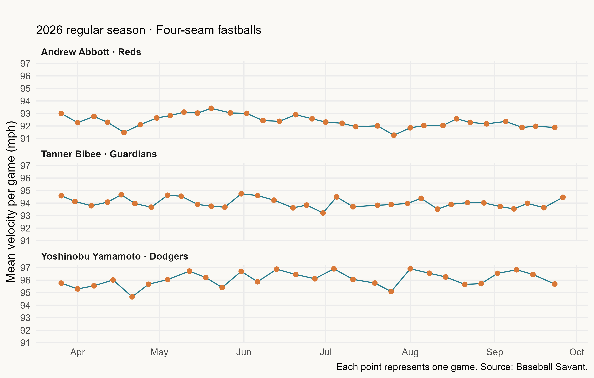
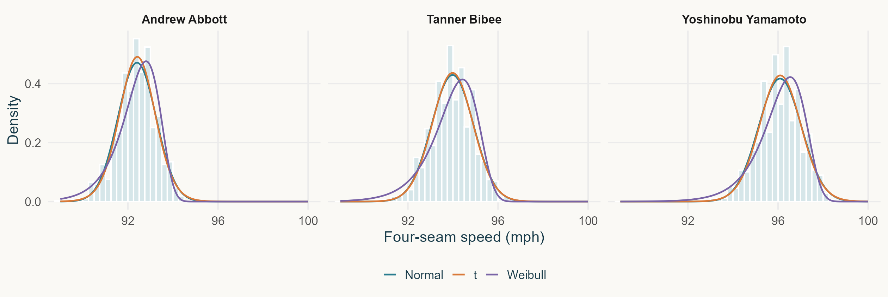
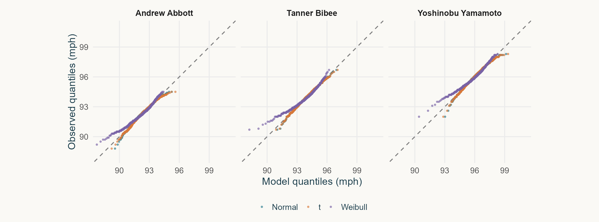
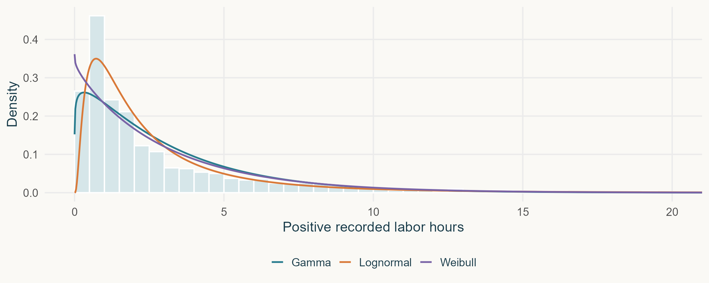
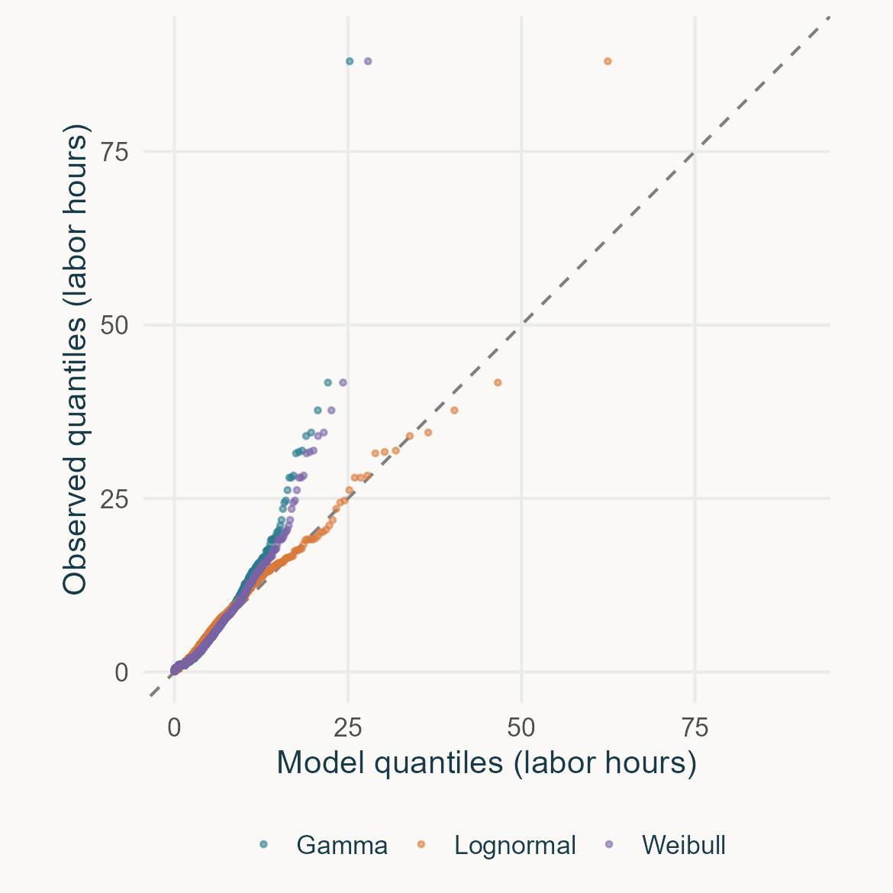
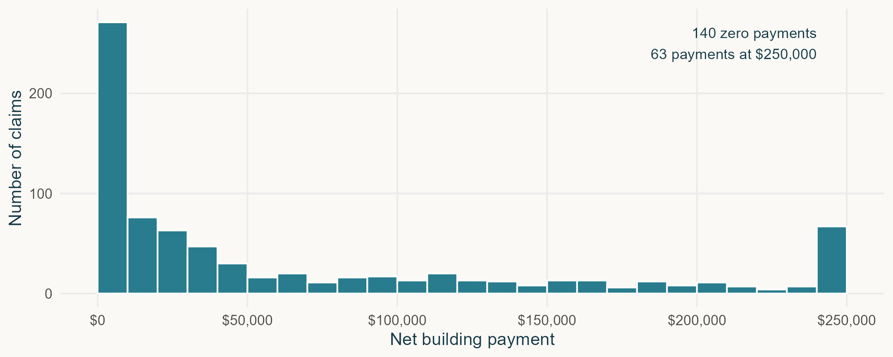
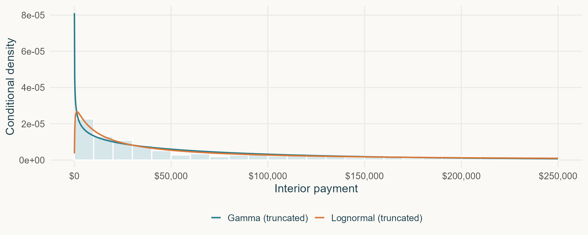

## Professor “Close Enough”

:::: {.columns}

::: {.column width="38%"}

> “Looks bell-shaped. Normal should be close enough.”

\

::: {.fragment}
**Similar shape. Similar probability?**

Could “close enough” change our estimate of a rare event?
:::

:::

::: {.column width="62%"}

```{r}
#| echo: false
#| warning: false
#| message: false
#| fig-width: 8
#| fig-height: 5
#| out-width: "100%"

pacman::p_load(emojifont, ggplot2, RefManageR)

# Illustration: both distributions have mean 0 and SD 1
df <- 5
t_scale <- sqrt((df - 2) / df)
cutoff <- 3

x <- sort(unique(c(seq(-5, 5, length.out = 2001), cutoff)))

curves <- rbind(
  data.frame(
    x = x,
    density = dnorm(x),
    model = "Normal"
  ),
  data.frame(
    x = x,
    density = dt(x / t_scale, df = df) / t_scale,
    model = "Student t"
  )
)

ggplot(curves, aes(x, density, color = model)) +
  geom_area(
    data = subset(curves, x >= cutoff),
    aes(fill = model),
    position = "identity",
    alpha = 0.3,
    color = NA
  ) +
  geom_line(linewidth = 1.1) +
  geom_vline(
    xintercept = cutoff,
    linetype = "dashed",
    color = "#596b71"
  ) +
  annotate(
    "text",
    x = cutoff,
    y = 0.16,
    label = "Threshold",
    hjust = -0.08,
    size = 4.5,
    color = "#596b71"
  ) +
  scale_color_manual(
    values = c("Normal" = "#287c8e", "Student t" = "#d97938")
  ) +
  scale_fill_manual(
    values = c("Normal" = "#287c8e", "Student t" = "#d97938")
  ) +
  labs(
    x = "Value",
    y = "Density",
    color = NULL,
    fill = NULL,
    subtitle = "Same mean and standard deviation",
    caption = "Shaded areas represent P(X > 3)"
  ) +
  theme_minimal(base_size = 23) +
  theme(
  legend.position = "bottom",
  legend.text = element_text(size = 21),
  axis.title = element_text(size = 22),
  axis.text = element_text(size = 18),
  plot.subtitle = element_text(size = 22),
  plot.caption = element_text(size = 21, hjust = 0),
  panel.grid.minor = element_blank(),
  plot.background = element_rect(
    fill = "#faf9f5", color = NA
  )
)
```

:::

::::

::: {.notes}
Both distributions are symmetric and bell-shaped, with mean zero
and standard deviation one. The t distribution has five degrees
of freedom and has been rescaled to have standard deviation one.

Ask students to compare the shaded areas. Density height is not
probability; probability is the area under the curve.

Beyond three standard deviations, the probabilities are about
0.135% for Normal and 0.586% for this t distribution.

This is an illustration, not a fit to the baseball data.
The question is whether a visually similar model gives a sufficiently accurate probability for the decision we need to make.
:::

## A closer look at the right tail

```{r}
#| echo: false
#| warning: false
#| message: false
#| fig-width: 9
#| fig-height: 4.5
#| out-width: "90%"
#| fig-align: center


ggplot(curves, aes(x, density, color = model)) +
  geom_area(
    data = subset(curves, x >= cutoff),
    aes(fill = model),
    position = "identity",
    alpha = 0.4,
    color = NA
  ) +
  geom_line(linewidth = 1.2) +
  geom_vline(
    xintercept = cutoff,
    linetype = "dashed",
    color = "#596b71"
  ) +
  coord_cartesian(xlim = c(2.5, 5), ylim = c(0, 0.02)) +
  scale_color_manual(
    values = c("Normal" = "#287c8e", "Student t" = "#d97938")
  ) +
  scale_fill_manual(
    values = c("Normal" = "#287c8e", "Student t" = "#d97938")
  ) +
  labs(
    x = "Value",
    y = "Density",
    color = NULL,
    fill = NULL,
    subtitle = "Right tail enlarged · Same distributions, same threshold"
  ) +
  theme_minimal(base_size = 24) +
  theme(
    legend.position = "bottom",
    panel.grid.minor = element_blank(),
    plot.background = element_rect(
      fill = "#faf9f5", color = NA
    )
  )
```

::: {.fragment}
**Beyond 3: Normal ≈ 0.135% · Student t ≈ 0.586%**

A similar-looking curve can give a very different tail probability.
:::

## A distribution answers a question

**A quantitative variable:** a numerical quantity we measure or count.

**A probability distribution:** how probability is assigned to its possible values.

A distribution model describes **shape, center, and spread**,
and helps us estimate **probabilities and percentiles**.

\

::: {.fragment}
**For repair labor hours…**

What proportion of jobs require more than 8 hours?

How many labor hours cover 90% of jobs?
:::
::: notes
1 minute. A physical mechanism can be causal while our predictions remain uncertain. Distinguish empirical distribution from a proposed parametric model. All examples today use observed data.
:::

## Is 94 mph fast? {background-color="#183b49"}

:::: {.columns}

::: {.column width="55%"}

**What are we measuring?**

Four-seam fastball release speed, in miles per hour (mph).

Typically a pitcher's fastest and straightest pitch.

\

**Three MLB pitchers**

- Andrew Abbott · Cincinnati Reds
- Tanner Bibee · Cleveland Guardians
- Yoshinobu Yamamoto · Los Angeles Dodgers

:::

::: {.column width="45%"}

**Why understand the distribution?**

- Establish a pitcher's usual velocity range.
- Identify unusually fast or slow pitches.
- Track changes over time.
- Support coaching and training decisions.

:::

::::


::: {.notes}
A fastball is a pitch type, not a pitch exceeding a fixed speed.

All three pitchers play in MLB. The Reds and Dodgers are in the
National League; the Guardians are in the American League.

Velocity changes can prompt further investigation, but do not
by themselves establish fatigue or injury.

1. Establish a personal baseline: Knowing a pitcher's typical velocity range is essential for determining whether today's speeds are abnormal.
2. Track changes: If the overall velocity distribution shifts toward lower speeds, it warrants coach intervention to investigate the pitcher's condition, mechanics, or training regimen. While this is a significant signal worth pursuing, it should not be used in isolation to diagnose fatigue or injury.
3. Evaluate pitch types alongside outcomes: Analyzing how the probability of a swing-and-miss or a hit changes based on velocity, location, and pitch type provides the necessary data to inform pitch-calling and training decisions.

2 minutes. Four-seam fastballs in regular-season Statcast records, March through September 2026. Ask for a show of hands about 94 mph. Speeds and counts are pitch-level observations, not independent player samples. Source: https://baseballsavant.mlb.com/statcast_search and https://baseballsavant.mlb.com/csv-docs
:::


## Does one distribution describe the whole season?

```{r}
#| echo: false
#| out-width: "95%"
#| fig-align: center


```

::: {.fragment}
Pooling the season may hide changes over time.
:::

::: {.notes}
Ask: Which pitcher appears to show the clearest change over time?

Abbott's game-average velocity appears higher around May and lower
later in the season. This is a visual pattern; the plot alone does
not establish its cause.

Each point is a game average. The distributions on the next slide
use individual pitch velocities.

Transition: Now let's pool each pitcher's pitches across the season.
What does the distribution look like—and what information do we lose?
:::


## Three pitchers, three fitted distributions

{width="100%"}

::: small
2026 regular-season four-seam fastballs. Normal, location-scale t, and two-parameter Weibull.
:::

::: notes
3 minutes. Ask whether bell-shaped means Normal. The t has an estimated location, scale and degrees of freedom, not the fixed standard t distribution. Weibull fixes the lower endpoint at zero. This is a descriptive pooled comparison: game-level dependence and changing baselines limit iid likelihood interpretation.
:::

## What does the comparison say?

| Pitcher  | Normal AIC |   t AIC | Weibull AIC |
|----------|-----------:|--------:|------------:|
| Abbott   |    3200.29 | 3197.22 |     3244.30 |
| Bibee    |    1877.28 | 1878.81 |     1943.72 |
| Yamamoto |    1970.04 | 1970.49 |     1995.87 |

::: small
Compare AIC within a pitcher. Lower means better relative fit after a parameter penalty.
:::

\

**Under our simplifying assumptions, AIC favors t for Abbott and Normal for Bibee and Yamamoto—but the Normal–t differences are small.**

\

::: fragment
**Lowest AIC among these candidates. Useful for our question?**
:::


::: notes
1 minute. AIC does not certify adequacy. Normal and t are close. Fitted t degrees of freedom are approximately 19.33, 47.95, and 31.27. Abbott has a modest preference for t (delta AIC 3.07); the other two prefer Normal by only 1.53 and 0.45. Avoid announcing a decisive universal winner. Weibull is a valid candidate but does not win here. Do not compare absolute AIC across different pitchers or datasets.

These comparisons use a likelihood that treats pitches as independent.
Interpret the AIC rankings cautiously because within-game dependence and changes over time are not modeled.
:::

## A closer look at the quantiles

{width="100%"}

::: notes
2 minutes. Both axes use mph and equal scale. Points near y=x suggest agreement at the corresponding quantile. A few extreme pitches can depart. Models fit the rounded reported speeds as continuous measurements. No diagnostic injury conclusion follows from a slow pitch.
:::

## A personal baseline changes the answer

| Pitcher  | Observed share above 94 mph |
|----------|----------------------------:|
| Abbott   |                       1.65% |
| Bibee    |                      47.56% |
| Yamamoto |                      97.62% |

An unusual pitch depends on the pitcher and the comparison period.

::: notes
2 minutes. Strictly greater than 94, not greater than or equal. Monitoring supports questions about performance, not causal diagnosis. Abbott's mean in March–May was about 92.68 mph versus 92.10 in August–September, so pooling the season can obscure a shifting baseline. A game mean has a different uncertainty from an individual pitch.
:::

\

### What did we assume?

- We treat each pitcher's velocity distribution as stable over the season.
- We treat individual pitches as independent observations.

::: fragment
**A good distributional fit does not establish independence or stability over time.**
:::

## Cincinnati repair work {background-color="#183b49"}

**How much mechanic labor does a repair require?**

:::: {.columns}

::: {.column width="55%"}
**What are these records?**

- City of Cincinnati fleet maintenance and repair work orders.
- Our subset: **2,869 closed repair orders** for police equipment, work-order year **2022**.

**What do we measure?**

Recorded labor hours per repair order.
:::

::: {.column width="45%"}
**Why understand the distribution?**

- Plan staffing and labor budgets.
- Estimate the proportion of labor-intensive jobs.
- Allow for unusually demanding repairs.
:::

::::

::: {.small}
Labor hours measure work effort—not elapsed repair time or vehicle downtime.

Source: [Cincinnati Open Data · Fleet Preventative Maintenance & Repair Work Orders](https://data.cincinnati-oh.gov/Thriving-Neighborhoods/Fleet-Preventative-Maintenance-Repair-Work-Orders/2a8x-bxjm)
::: 

::: notes
2 minutes. Fleet equipment, not verified individual passenger vehicles. An order is the observation; equipment can contribute several orders. Work-order year defines the cohort, not necessarily completion year. Latest public observations in the downloaded source stop in August 2023 despite metadata suggesting daily updates. Source: https://data.cincinnati-oh.gov/Thriving-Neighborhoods/Fleet-Preventative-Maintenance-Repair-Work-Orders/2a8x-bxjm . Labor hours are recorded aggregate labor; they do not measure elapsed downtime. Downtime definitions were too vague to support the earlier time-to-return story.
:::

## Typical work and total work

**Median: 1.6 labor hours**

**Mean: 3.10 labor hours**

A few large jobs increase total labor demand.

::: small
32 orders record zero labor. Positive-labor models use the remaining 2,837 orders.
:::

::: notes
1 minute. Median and mean here include the 32 zeros. Maximum is 88 hours, retained. Around 0.70% of all orders exceed 20 hours. Some common exact values may reflect recording practices or standard tasks. Do not interpret labor as customer waiting time or one mechanic's shift.
:::

## Three models for positive labor

{width="100%"}

::: small
Models use all positive values. Display shows 0–20 hours, with the longer tail outside the view.
:::

::: notes
2 minutes. Compare the peak and body. A density height is not a probability; area over a range gives probability. Rounded work hours create ties that a smooth density cannot reproduce as point masses. All models include the 88-hour observation.
:::

## Lognormal fits best among these candidates {.qq-slide}

{height="420px"}

::: notes
2 minutes. Equal axis scaling. AIC: Gamma 12147.59, Lognormal 11526.07, Weibull 12166.14. Lognormal has lowest AIC/BIC and lower KS/CvM/AD descriptive discrepancies in the user's R run. This is a relative comparison, not an adequacy certificate or future validation.
:::

## Which model gets a large job right?

| Positive-labor orders above 8 hours |     Share |
|-------------------------------------|----------:|
| Observed                            | **8.81%** |
| Gamma                               |     7.19% |
| Lognormal                           |     6.98% |
| Weibull                             | **7.96%** |

**Weibull is closer at this threshold. Lognormal fits better overall.**

::: notes
3 minutes. Ask whether lowest AIC makes every estimate most accurate. All estimates come from fitting and evaluating the same sample, so this is an illustration of task-specific fit rather than a forecasting contest. Eight labor hours is an illustrative staffing threshold, not an official service standard. Tail frequency alone is not total workload; job sizes and arrival volume also matter.
:::

## Why does fit matter?

A distribution changes estimated probabilities and percentiles.

Underestimating large jobs can reduce planned capacity.

Acceptable error depends on the decision and its consequences.

::: notes
1 minute. No empirical claim that Cincinnati actually uses these models or suffered understaffing. These are teaching applications. Gamma MLE matches the positive sample mean closely even though it misses other features; use that fact to distinguish mean estimation from tail estimation. Future planning needs volume and validation across time or equipment.
:::

## Flood claims after Hurricane Helene {background-color="#183b49"}

**Where do these data come from?**

The **Federal Emergency Management Agency (FEMA)** manages
the **National Flood Insurance Program (NFIP)**.

**Our sample**

- **781 flood insurance claims** associated with Hurricane Helene.
- North Carolina · 2024 losses · Single-family homes.
- Each policy has **$250,000 in building coverage**.

**What do we measure?**

Recorded building claim payments—not total flood damage.

::: {.small}
Source: [OpenFEMA · NFIP Redacted Claims, Version 3](https://www.fema.gov/openfema-data-page/nfip-redacted-claims-v3)

Data snapshot: September 8, 2026 · Payments may change as claims develop.
:::


::: notes
2 minutes. Source: https://www.fema.gov/openfema-data-page/nfip-redacted-claims-v3 and https://www.fema.gov/api/open/v3/NfipClaims . Filter occupancyType=11, floodEvent='Hurricane Helene', state NC, yearOfLoss 2024, totalBuildingInsuranceCoverage=250000. Variable netBuildingPaymentAmount. Snapshot asOfDate September 8 2026. Claims may develop; no closed-status field establishing finalization. Paid amount differs from total damage or latent loss. One storm creates dependence across claims.
:::

## The policy helps shape the distribution

{width="100%"}

::: notes
3 minutes. Equal \$10,000 bins including 0 and cap. Histogram endpoints are not smooth tails. 140 zeros and 63 exactly at cap. Zero payment does not establish zero damage or claim denial. Mean about \$67,137 and median \$26,453. We do not infer policy-level claim probability from a sample containing claims only.
:::

## A mixed distribution for payments

A point mass at **\$0**: 17.93%

A continuous interior between \$0 and \$250,000: 74.01%

A point mass at **\$250,000**: 8.07%

::: notes
2 minutes. Rounded percentages may sum to 100.01. This is a mixed discrete–continuous payment model, not a discovered mixture of latent customer groups. Endpoint masses are empirical. Interior distribution is explicitly conditioned on lying between zero and cap. A cap atom does not reveal the distribution of losses beyond the cap.
:::

## One curve for the interior?

{width="100%"}

::: small
578 interior claims. Truncated Lognormal has lower AIC (ΔAIC ≈ 32.78).
:::

::: notes
2 minutes. Truncated Lognormal has lower AIC than truncated Gamma in this exploratory likelihood comparison, delta AIC about 32.78. The normalization is F(cap)-F(0). Do not present ordinary fits after simply deleting capped claims. Generalized Pareto splicing or latent mixtures remain candidates for future work, not tested findings. No uncapped-loss tail is identified from the cap values.
:::

## Ordinary claims and unusually large claims

Could different mechanisms require different distributions?

**Mixture:** overlapping components for different latent groups.

**Splicing:** one model below a threshold, another above it.

::: notes
1 minute. A Lognormal body and GPD tail is a possible example, not a fitted model here. Threshold choice, sufficient exceedances and treatment of the policy cap need scrutiny. More flexible models can overfit. For paid amount, the cap and zero masses remain part of the model. Avoid claiming this dataset proves a mixture mechanism.
:::

## Insurance decisions need frequency and severity

Expected payment per policy requires:

$$P(\text{claim})\times E(\text{payment}\mid\text{claim}).$$

Claim records describe severity. Policy exposure supplies the frequency denominator.

::: notes
2 minutes. Formula assumes at most one claim or a binary indicator over a specified period. With multiple claims, use expected count times appropriate average severity under the needed conditions. Pricing, reserves and policy design are applications, not advice to price from this storm alone. Shared storms matter for portfolio totals.
:::

## Professor “Close Enough” revisited

Close enough for a typical value?

Close enough for a tail probability?

Close enough for the decision you need to make?

::: notes
2 minutes. Ask students which fit measure they would use for each case. Evidence can support different answers for different tasks. All candidates can be poor. Check support, recording, dependence, time changes, and decision-specific errors without overwhelming the introductory audience.
:::

## You can make a presentation like this

This presentation uses **Quarto**.

A `.qmd` file combines Markdown, code, and presentation settings.

**MTH 209** introduces the skills behind reproducible statistical documents.

::: notes
1 minute. User supplied the course connection. Avoid promising a specific current Quarto syllabus. Mention data and source code are available to explore. Questions can use the final five minutes; adjust discussion to the 45-minute slot.
:::

## All models are wrong, but some are useful {background-color="#183b49"}

George Box

**Useful for what?**

::: notes
1 minute. Attribution: George E. P. Box, Robustness in the Strategy of Scientific Model Building, 1979. The wording is the familiar quotation. Return to the decision before concluding that a better AIC alone is enough.
:::
