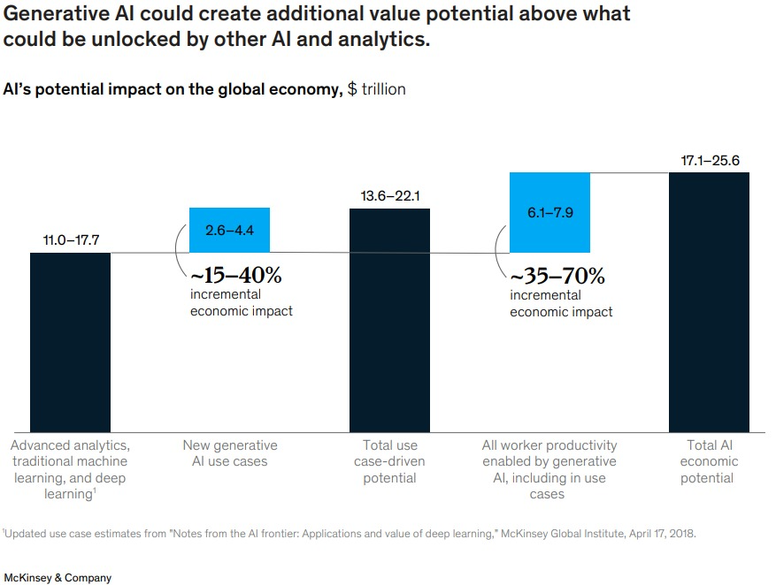
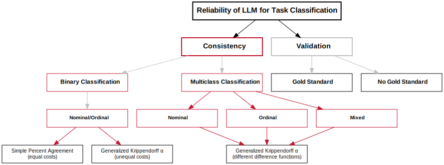

```{r setup, include=FALSE}
knitr::opts_chunk$set(cache = TRUE,
                      echo = FALSE,
                      warning = FALSE,
                      message = FALSE,
                      progress = FALSE, 
                      verbose = FALSE,
                      dev = 'png',
                      fig.height = 3,
                      dpi = 300,
                      fig.align = 'center')

options(htmltools.dir.version = FALSE)


miamired = '#C3142D'

if(require(pacman)==FALSE) install.packages("pacman")
if(require(devtools)==FALSE) install.packages("devtools")
if(require(countdown)==FALSE) devtools::install_github("gadenbuie/countdown")
if(require(xaringanExtra)==FALSE) devtools::install_github("gadenbuie/xaringanExtra")
if(require(emo)==FALSE) devtools::install_github("hadley/emo")
if(require(icons)==FALSE) devtools::install_github("mitchelloharawild/icons")

pacman::p_load(tidyverse, magrittr, lubridate, janitor, # data analysis pkgs
               DataExplorer, scales, plotly, calendR, pdftools, knitr,# plots
               #tmap, sf, urbnmapr, tigris, # maps
               bibliometrix, # for bibliometric analysis of my papers
               gifski, av, gganimate, ggtext, glue, extrafont, # for animations
               emojifont, emo, RefManageR, xaringanExtra, countdown) # for
```

```{r xaringan-themer, include=FALSE, warning=FALSE}
if(require(xaringanthemer) == FALSE) install.packages("xaringanthemer")
library(xaringanthemer)

style_mono_accent(base_color = "#84d6d3",
                  base_font_size = "20px")

xaringanExtra::use_extra_styles(
  hover_code_line = TRUE,         
  mute_unhighlighted_code = TRUE  
)

xaringanExtra::use_xaringan_extra(c("tile_view", "animate_css", "tachyons", "panelset", "share_again", "search", "fit_screen", "editable", "clipboard"))

```


# Our Research Team

```{r team, out.width="90%", fig.alt="Our Research Team"}

```

---
# The Road to Large Language Models

<br>

```{r generative_ai_chart_out, out.width='100%', dpi = 600, fig.alt='From big data to big models, a flow chart documenting how we got to large language models'}
knitr::include_graphics('figs/generative_ai_chart.png')
```

.footnote[
<html>
<hr>
</html>

**Comment:** You have been hearing about **big data** in SPC for over a decade now. In fact, we presented our paper, [Statistical Perspectives on Big Data](https://citeseerx.ist.psu.edu/document?repid=rep1&type=pdf&doi=ab40f392e653b7336cbebf7c4fb95d3988748282), almost exactly 11 years ago in the ISQC Workshop in Sydney. We now have models that can digest questions/prompts and generate answers based on more than 45TB of text. 
]

---

# Uniqueness of LLMs vs. Earlier AI Models

.content-box-gray[
.bold[.red[LLMs:]] .bold[The objective is to generate new content rather than analyze existing data.]
]

.font90[
-  The generated content is based on a .bold[.red[stochastic behavior embedded in generative AI models such that the same input prompts results in different content]].
- LLMs with known model sizes can have up to **540 billion parameters** ([PaLM](https://arxiv.org/abs/2204.02311)). Note that state-of-the-art models like *GPT-4o*, *PaLM 2* and *Claude Sonnet 3.5* **have not revealed their model sizes**.
- With the increase in model size, researchers have observed the **“emergent abilities”** of LLMs, which were **not explicitly encoded in the training**. [Examples include](https://ai.googleblog.com/2022/11/characterizing-emergent-phenomena-in.html):
  + Multi-step arithmetic, and  
  + taking college-level exams.  
- LLMs are **foundation models** (see [Bommasani et al. 2021](https://arxiv.org/abs/2108.07258)), large pre-trained AI systems
that can be **repurposed with minimal effort across numerous domains and diverse tasks.**
]


---

# Generative AI Hype (2023)

```{r mckinsey_ai, echo=FALSE, out.width='60%'}

```

.footnote[
<html>
<hr>
</html>

**Image Source:** [McKinsey & Company (July 2023). The economic potential of generative AI: The next productivity frontier](https://www.mckinsey.com/capabilities/mckinsey-digital/our-insights/the-economic-potential-of-generative-ai-the-next-productivity-frontier#/)
]


---

# Generative AI Hype (2024)

.pull-left[
```{r google_ai, echo=FALSE, out.width='90%'}
knitr::include_graphics('figs/google_ai.png')
```

.center[
.font80[Andrew McAfee (2024). [Generally Faster: The Economic Impact of Generative AI](https://storage.googleapis.com/gweb-uniblog-publish-prod/documents/Generally_Faster_-_The_Economic_Impact_of_Generative_AI.pdf)]
]
]

.pull-right[
```{r ssn_2024, echo=FALSE, out.width='100%'}
knitr::include_graphics('figs/gen_ai_coders_sept_2024.jpeg')
```

.center[.font80[Cui et al. (2024). [SSRN 4945566](https://papers.ssrn.com/sol3/papers.cfm?abstract_id=4945566)]]

]


---
# 🤦🏻‍♀ But also Our Experience in October of 2024

```{r rock_paper, echo=FALSE, out.width='58%'}

```


.footnote[
<html>
<hr>
</html>

**Source:** [Playing Rock Paper Scissors with ChatGPT 4o on October 23, 2024.](https://chatgpt.com/share/6718eab4-5ebc-800a-a521-c25a136947b9) **Credit:** Fadel M. Megahed
]


---
class: inverse, center, middle

# On the Use of LLMs, such as ChatGPT, in SQC

<br>

.pull-left-2[<br>Megahed, F. M., Chen, Y. J., Ferris, J. A., Knoth, S., & Jones-Farmer, L. A. (2024). How generative AI models such as ChatGPT can be (mis)used in SPC practice, education, and research? An exploratory study. *Quality Engineering*, 36(2), 287–315.

[Freely available @ [arXiv](https://arxiv.org/pdf/2302.10916.pdf)].]

.pull-right-2[<div></div>]


---

# Our Overarching Research Question

.content-box-red[
.bold[What can generative LLM-based AI tools do now to augment the roles of SPC practitioners, educators, and researchers?]

]

-  **Secondary goal:** To motivate the SPC community to be receptive to exploring whether new AI tools can help them be more **efficient**, **productive**, and **innovative**. This is consistent with:

  + Box and Woodall ([2012](https://www.tandfonline.com/doi/10.1080/08982112.2012.627003)): “we stress the necessity for the quality engineering community to strengthen and promote its role in **innovation**”, and  
  + Hockman and Jensen ([2016](https://www.tandfonline.com/doi/10.1080/08982112.2015.1083107)): “for statisticians to be successful in leading innovation, they will need to strengthen their **skills beyond what they have traditionally needed in the past**, but we believe this will be worth the effort”.  
  
- **Scope:** We evaluated the utility of ChatGPT (GPT-3.5 engine) as of its *Jan 30, 2023 Version*.   

---

# Our Study Design

```{r study_design, include=FALSE, out.width="68%"}

```
<center>

</center>


---

# The Good: Knowledge Generation


.bold[Inspired by the TEDxBoston talk titled [what we learned from 5 million books](https://www.ted.com/talks/jean_baptiste_michel_erez_lieberman_aiden_what_we_learned_from_5_million_books?language=en), we asked ChatGPT the following question:]

<br>

> .bold[.large["What are open issues in statistical process control research?'']]

<br>

### Why this question seemed like a reasonable prompt?
.bold[ChatGPT likely “read” and “can recall” more SPC research papers than most of us] 

---


# The Good: Knowledge Generation

```{r spc_research_knowledge, echo=FALSE, out.width='60%', fig.alt='Chat GPT highlighted six areas where there are open issues in statistical process control. We will highlight the main themes in the next slide'}
knitr::include_graphics('figs/research_prompt_08_fig_01.png')
```


---


# The Good: Knowledge Generation

.content-box-red[
.center[.bold[.large[Some Thoughts on the ChatGPT Answer]]]

- It captured .bold[reasonable themes, e.g., ]
  + incorporating .bold[big data and machine learning] techniques, 
  + .bold[online/real-time monitoring] solutions where 100% sampling is employed, 
  + the need for .bold[non-normality], and 
  + .bold[applications to new domains].  

- In our opinion, .bold[value is in using it as a high-level tool for idea generation/validation].  
- Potentially .bold[“stale”] as [Chat(GPT)-3.5 “finished training in early 2022”](https://openai.com/blog/chatgpt/) and is limited to [data up to Sept 2021](https://community.openai.com/t/knowledge-cutoff-date-of-september-2021/66215).  
  + Probably not an issue for future LLM generations (.bold[Why?])
]


---

# The Bad: Precise Definitions

```{r imprecise, out.width='44%', echo=FALSE, fig.alt="ChatGPT's generated response for our prompt of explain the practitioner-to-practitioner variability. Its response is somewhat long and imprecise. Specifically, ChatGPT presented five factors, which share a common feature; all deal with differences on the method level, i.e., chart type, subgroup design, techniques to calculate the limits, dealing with outliers, and choice of software. While we agree that these factors are important and will drive different results, ChatGPT's answer ignores the context for which the practitioner-to-practitioner variability is used in the SPC literature. In fact, the practitioner-to-practitioner variability refers to the variation that occurs with a fixed configuration of the five aforementioned factors, i.e., the variation results from multiple implementations of the same procedure on the same data-generating process."}

```


---

# The Ugly: ChatGPT's Hallucination

.bold[To detect whether ChatGPT can detect erroneous requests, we asked:]

<br>

> .bold[.large["Can you use the ‘bigfish' dataset from the qcc library in R to create a control chart?'']]

<br>

### Why this question seemed like a reasonable prompt?
.bold[In an earlier question (within the same thread), ChatGPT answered a question by using the `qcc` package, i.e., is .red[familiar with it], and .red[detecting unreasonable requests would be a strong feature for non-expert users].]


---


# The Ugly: ChatGPT's Hallucination

```{r bigfish1, out.width='56%', echo=FALSE, fig.alt='The ChatGPT hallucination, answering a question about a non-existent dataset in the qcc library'}
knitr::include_graphics('figs/practice_prompt_03_fig_01.png')
```


---


# The Ugly: ChatGPT's Hallucination

```{r bigfish2, out.width='80%', echo=FALSE, fig.alt='ChatGPT making up details about the non-existent bigfish dataset and saying it is popular in the SPC community'}
knitr::include_graphics('figs/practice_prompt_03_fig_02.png')
```


---

# The Ugly: ChatGPT's Hallucination (GPT-4o)

<div style="margin-top: -10px;">
    <center>
        <video style="width: 100%; max-height: 63vh;" controls id="myVideo">
            <source src="figs/bigfish.mp4" type="video/mp4">
        </video>
    </center>
</div>

<script>
    var video = document.getElementById('myVideo');
    video.addEventListener('loadedmetadata', function() {
        video.currentTime = 11;
        video.playbackRate = 1.25;
    }, false);
</script>

.footnote[
<html>
<hr>
</html>

**Note:** This trial was performed solely for our presentation. The model used herein should be a **much improved model** compared to the 3.5-model examined in the original paper. Yet, the **hallucination** has remained.
]

---
class: inverse, center, middle

# ChatSQC: Our Grounded App, to address Imprecise SQC Answers and Hallucinations


.pull-left-2[<br>Megahed, F. M., Chen, Y. J., Zwetsloot, I., Knoth, S., Montgomery, D.C., & Jones-Farmer, L. A. (2024). Introducing ChatSQC: Enhancing Statistical Quality Control with Augmented AI. *Journal of Quality Technology*, 56(5), 474-497.

[Freely available @ [arXiv](https://arxiv.org/pdf/2308.13550)].

<br>

Jones-Farmer, L. A., Megahed, F. M., Chen, Y. J., Zwetsloot, I., Knoth, S., Montgomery, D. C., & Capizzi, G. (2024). [Editorial advice for selecting an open-source license for your next paper: Navigating copyrights for publicly facing AI chatbots.](https://www.tandfonline.com/doi/full/10.1080/00224065.2024.2391682) *Journal of Quality Technology*, 56(5), 468-473.
]

.pull-right-2[<br>
<div></div>
]


---

# The Construction of ChatSQC

```{r chatsqc, out.width='80%', echo=FALSE, fig.alt='The construction of ChatSQC involved four main phases: (a) a one-time extraction of the reference material, (b) a one-time preprocessing of the extracted material, (c) a continuous (online) chat inference, and (d) the hosting/deployment of the app on a web server.'}
knitr::include_graphics('figs/ChatSQC_flowchart_new.png')
```

---

# A Live Demo of ChatSQC

<center>
    <a href="https://chatsqc.osc.edu/">
        
    </a>
</center>

.footnote[
<html>
<hr>
</html>

**Note:** We encourage the audience to experiment with **ChatSQC** at <https://chatsqc.osc.edu/>.
]


---
class: inverse, center, middle

# ChatISA: Our In-House Bot for Students

<br>

.pull-left-2[<br>Megahed, F. M., Chen, Y. J., Ferris, J.A., Resatar, C., Ross, K., Lee, Y., & Jones-Farmer, L. A. (2024). ChatISA: A Prompt-Engineered Chatbot for Coding, Project Management, Interview and Exam Preparation Activities. Under review.

[Freely available @ [arXiv](https://arxiv.org/abs/2407.15010)].]

.pull-right-2[<div></div>]


---

# A Live Demo of ChatISA

<center>
    <a href="https://chatisa.fsb.miamioh.edu/">
        
    </a>
</center>

.footnote[
<html>
<hr>
</html>

**Note:** We encourage the audience to experiment with **ChatISA** at <https://chatisa.fsb.miamioh.edu/>. If we have time, we can also go over [this pre-recorded and sped-up demo of the Exam Ally module](https://www.loom.com/share/239950fad0e24ef1875e8d5fb35cbe60).
]


---
class: inverse, center, middle

# How Can Industrial Statistics Inform LLM Usage and Evaluation? Some Initial Thoughts

<br>

<br>Megahed, F. M., Chen, Y. J., Jones-Farmer, L. A., Knoth, S., Lee, Y., Montgomery, D.C.,  &  Wang, B., Zwetsloot, I. (2024). Work In Progress.

---

# LLM Usage in Business and Industry

```{r use_cases, include = FALSE, out.width='70%'}
graph = DiagrammeR::grViz("
  digraph LLM_Use_Cases {
    graph [fontsize=12, overlap=true]

    node [shape = box, fontname = Arial, fontcolor = black]

    UseCases [label = <<B>Use Cases</B>>, fontsize=16]
    HighlyUseful [label = <<B>Highly Useful </B>>, fontsize=14]
    SomewhatUseful [label = <<B>Somewhat Useful </B>>, fontsize=14]
    HardlyUseful [label = <<B>Hardly Useful </B>>, fontsize=14]

    ContentCreation [label = 'Content\nCreation']
    Chatbots [label = 'Chatbots']
    KnowledgeDiscovery [label = 'Knowledge\nDiscovery']

    SegmentationClassification [label = 'Segmentation/\nClassification\nand\n Recommendation\nSystems', fontcolor = '#C3142D', fontname = Arial, style = bold, penwidth = 4, color = '#C3142D', fontface = 'bold', fillcolor='white', style ='filled']
    IntelligentAutomation [label = 'Intelligent\nAutomation']
    AnomalyDetection [label = 'Anomaly\nDetection\nand\nMonitoring']

    PredictionForecasting [label = 'Prediction/\nForecasting']
    Planning [label = 'Planning']
    DecisionIntelligence [label = 'Decision\nIntelligence']

    UseCases -> HighlyUseful
    UseCases -> SomewhatUseful
    UseCases -> HardlyUseful

    HighlyUseful -> ContentCreation
    HighlyUseful -> Chatbots
    HighlyUseful -> KnowledgeDiscovery

    SomewhatUseful -> SegmentationClassification
    SomewhatUseful -> IntelligentAutomation
    SomewhatUseful -> AnomalyDetection

    HardlyUseful -> PredictionForecasting
    HardlyUseful -> Planning
    HardlyUseful -> DecisionIntelligence
  }
")

graph |> DiagrammeRsvg::export_svg() |> xml2::read_xml() |> 
  xml2::write_xml("figs/use_cases.svg")
```


```{r use_cases_out, echo=FALSE, out.width='100%'}
knitr::include_graphics("figs/use_cases.svg") 
```

.footnote[
<html>
<hr>
</html>

**Created By:** Fadel Megahed based on the text in the article by Ava McCartney. (2024). "When Not to Use Generative AI", *Gartner*. The article was published on April 23, 2024 and last accessed on June 14, 2024. It can be accessed at <https://www.gartner.com/en/articles/when-not-to-use-generative-ai>.
]

---

# Current Research on LLM-based Classification

```{r three_papers_crop, echo=FALSE, out.width='70%'}
knitr::include_graphics("figs/adjusted_paper_info.gif")
```

.footnote[
<html>
<hr>
</html>

**Note:** The paper by [Eisfeldt et al. (2023)](https://www.nber.org/papers/w31222) is what led to our collaboration with Brooke Wang and started our latest work in this area.
]

---

# "Generative AI and Firm Values:" An Overview

```{r andrea_paper, include=FALSE}
graph2 = DiagrammeR::grViz("
digraph flowchart {
  node [fontsize=12,shape = box, fontname = Arial]
  
  InputJobsTasks [label = 'Job-Task Pairings']
  InputSystemPrompt [label = 'System Prompt along with a task classification rubric']
  ToolChatGPT [label = <<b>ChatGPT 3.5</b>>, penwidth = 2, fillcolor = 'white', color = '#C3142D', styled = 'filled']
  OutputClassification [label = <<b>AI exposure classification for each task     </b>>, penwidth = 4]
  
  InputJobsTasks -> ToolChatGPT [label = <<b>Input</b>>, fontcolor = '#C3142D']
  InputSystemPrompt -> ToolChatGPT [label = <<b>Input</b>>, fontcolor = '#C3142D']
  ToolChatGPT -> OutputClassification [label = <<b>Generation</b>>, fontcolor = '#C3142D']
  
  OutputClassification -> E0 [arrowhead = none, style = 'dashed, dot', color = 'gray']
  OutputClassification -> E1 [arrowhead = none, style = 'dashed, dot', color = 'gray']
  OutputClassification -> E2 [arrowhead = none, style = 'dashed, dot', color = 'gray']
  OutputClassification -> E3 [arrowhead = none, style = 'dashed, dot', color = 'gray']
  
  E0 [label = 'E0: No exposure', penwidth = 1, color = 'gray', fillcolor = white, style = 'filled, dashed']
  E1 [label = 'E1: Direct Exposure', penwidth = 1, color = 'gray', fillcolor = white, style = 'filled, dashed']
  E2 [label = 'E2: Exposure by LLM-powered applications', penwidth = 1, color = 'gray', fillcolor = white, style = 'filled, dashed']
  E3 [label = 'E3: Exposure given image capabilities', penwidth = 1, color = 'gray', fillcolor = white, style = 'filled, dashed']
}
")

graph2 |> DiagrammeRsvg::export_svg() |> xml2::read_xml() |> 
  xml2::write_xml("figs/andrea_paper.svg")
```

```{r andrea_paper_output, echo=FALSE, out.width='100%'}

```

.footnote[
<html>
<hr>
</html>

**Note:** Our best attempt to summarize the work of Eisfeldt et al. (2023). "Generative AI and Firm Values". Available from <https://www.nber.org/papers/w31222>. Note that this chart was created by Fadel Megahed and that the authors randomly passed job-task pairings into ChatGPT and repeated this process 3 times to measure its consistency for classification.
]


---

# "Generative AI and Firm Values:" Pairings

.font70[
A random sample drawn from `r readr::read_csv("parsed_results.csv") |> dplyr::filter(
    occupation %in% c('Statisticians', 'Biostatisticians', 'Statistical Assistants')
    ) |> nrow()` occupation-task pairings, for **biostatisticians**, **statistical assistants**, and **statisticians**.
    ]

```{r pairings, include=FALSE}
set.seed(062024)
results = readr::read_csv("parsed_results.csv") |> 
  dplyr::filter(
    occupation %in% c('Statisticians', 'Biostatisticians', 'Statistical Assistants')
    ) |> 
  dplyr::select(occupation, task_description, gpt_label) |> 
  dplyr::group_by(occupation) |> dplyr::sample_n(size = 3)

results |> 
  dplyr::mutate(
    gpt_label = kableExtra::cell_spec(
      gpt_label, 
      color = dplyr::case_when(
        gpt_label == 'E0' ~ "#A9A9A9", gpt_label == 'E2' ~ "#FEB24C",
        gpt_label == 'E3' ~ "#FD8D3C", gpt_label =='E1' ~ "#C3142D"
      ) 
    )
  ) |> 
  kableExtra::kbl(booktabs = F, linesep = "", escape = F) |>
  kableExtra::kable_styling(full_width = T, bootstrap_options = 'none') |> 
  kableExtra::column_spec(1, bold=T)  |> 
  kableExtra::column_spec(3, bold=T) 
```


.font70[
```{r pairings_out, echo=FALSE, ref.label='pairings', results='asis'}
# printing out the results of the pairings code chunk
```
]

.footnote[
<html>
<hr>
</html>

**Note:** Using the rubric from [Eisfeldt et al. (2023)](https://www.nber.org/papers/w31222), we utilized GPT3.5-Turbo on March 24, 2024 to classify 19,281 occupation-task pairings per the request of our colleague [Brooke Wang](https://www.jiaweibrookewang.com/). 
]


---

# "Generative AI and Firm Values:" Consistency

.font80[
> To validate the consistency and replicability
of our procedure, we compare the scores assigned across **3 different GPT runs** ... for a **randomly selected subsample of 100 task statements**.  

> We compare the different sets of scores as follows: First, we construct **3 different classifications for each task** based on the assigned score: 
  - **Current exposure:** score 1 has been assigned.  
  - **Expected exposure:** Either score 1 or 2 has been assigned.  
  - **Broad exposure:** Any score other than 0 has been assigned. 
  
> Then, we **compute the agreement** between different scoring runs with regard to which tasks belong in these categories. The comparison between different runs is shown (below). 

]


```{r esf_out, echo=FALSE, out.width='50%'}

```

.footnote[
<html>
<hr>
</html>

**Source:** The quotes and the results in the table are from [Eisfeldt et al. (2023)](https://www.nber.org/papers/w31222). 
]


---

# Alternatively: Percent vs. Expected Agreement

.font80[
We made 5,000 GPT3.5-Turbo API calls (1000 occupation-task pairings $\times$ 5 replicates) and obtained:
]

```{r pct_agreement, echo=FALSE, out.width='80%'}

```

.footnote[
<html>
<hr>
</html>

**Note:** This is also an **imperfect** approach since it assumes that all outcomes are equally likely/important.
]


---

# Conjectures

.font80[
> There is no knowledge without **theory** ... Experience
 teaches nothing without a **theory**  ... Without theory you have
 nothing to revise, nothing to learn from ... **You have no way to
 use the information that comes to you.**  -- [Deming (1993)](https://mitpress.mit.edu/9780262535939/the-new-economics-for-industry-government-education/)
]

<br>

.font80[
> Interestingly, **mathematics and statistics are perhaps the only disciplines that tend to equate "theory" with "mathematics."** 

> Biologists, geologists, and scientists in most other disciplines understand that **theory may or may not be mathematical in nature**. 

> [Madigan and Stuetzle](https://academiccommons.columbia.edu/doi/10.7916/D8ZG73DT/download) ... made this point:  "The issues we raise above have nothing to do with the old distinction between applied statistics and theoretical statistics. The traditional viewpoint equates statistical theory with mathematics and hence with intellectual depth and rigor, but this misrepresents the notion of theory. We agree with the viewpoint that David Cox expressed at the 2002 NSF Workshop on the Future of Statistics that **'theory is primarily conceptual,' rather than mathematical**."

]

.footnote[
<html>
<hr>
</html>

**Source:** The quote (as well as the quotes and references within) are from: Hoerl, R.W. and Snee, R.D. (2010). [Moving the Statistics Profession Forward to the Next Level](https://www.tandfonline.com/doi/epdf/10.1198/tast.2010.09240). *The American Statistician*, 64(1), 10-14.
]


---

background-image: url("figs/stevens_science_paper.png")
background-position: right
background-size: contain

# On the Theory of <br/> Scales of Measurement

.pull-left-2[
An initial and reasonable **starting point** for evaluating LLM output in task classification scenarios is to utilize the seminal work of Stanley Stevens. From here, we can think of:

- What is the **data type** of the label?  

- How should **different data types** be evaluated from an **interrater reliability** perspective?
]

.footnote[
<html>
<hr>
</html>

**Source:** Stevens, S. S. (1946). [On the theory of scales of measurement](https://www.jstor.org/stable/pdf/1671815.pdf). Science, 103(2684), 677-680.
]

---

# From Theory to LLM Practice: Initial Thoughts

```{r theory_to_practice, echo=FALSE}
library(DiagrammeR)

alpha <- "\u03B1"

graph_string <- paste0("
  digraph LLM_Reliability {
    graph [fontsize=12, overlap=true]

    node [shape = box, fontname = Arial, fontcolor = black, style=filled, fillcolor=white, width=2.25]

    Reliability [label = <<B>Reliability of LLM for Task Classification    </B>>, fontsize=15, color = black, style = bold, penwidth = 2, width = 3]
    Consistency [label = <<B>Consistency</B>>, fontsize=14, color =\"#C3142D\", style = bold, penwidth = 2]
    Validation [label = <<B>Validation</B>>, fontsize=14, color = gray, style = bold, penwidth = 2]

    BinaryClassification [label = <<B>Binary Classification</B>>, fontsize=12, color=\"#C3142D\"]
    NominalOrdinal [label = <<B>Nominal/Ordinal</B>>, fontsize=10, color=\"#C3142D\"]
    SimplePercentAgreement [label = 'Simple Percent Agreement\n(equal costs)', fontsize=10, color = black]
    KrippendorffAlpha [label = 'Generalized Krippendorff ", alpha, "\n(unequal costs)', fontsize=10, color = black]

    MulticlassClassification [label = <<B>Multiclass Classification</B>>, fontsize=12, color=\"#C3142D\"]
    Nominal [label = <<B>Nominal</B>>, fontsize=10, color=\"#C3142D\"]
    Ordinal [label = <<B>Ordinal</B>>, fontsize=10, color=\"#C3142D\"]
    Mixed [label = <<B>Mixed</B>>, fontsize=10, color=\"#C3142D\"]
    KrippendorffAlphaMulticlass [label = 'Generalized Krippendorff ", alpha, "\n(different difference functions)', fontsize=10, color = black]

    GoldStandard [label = <<B>Gold Standard</B>>, fontsize=12, color = black]
    NoGoldStandard [label = <<B>No Gold Standard</B>>, fontsize=12, color = black]

    Reliability -> Consistency [color=black]
    Reliability -> Validation [color=black]
    Consistency -> BinaryClassification [color=gray]
    BinaryClassification -> NominalOrdinal [color=gray]
    NominalOrdinal -> SimplePercentAgreement [color=\"#C3142D\"]
    NominalOrdinal -> KrippendorffAlpha [color=\"#C3142D\"]
    Consistency -> MulticlassClassification [color=gray]
    MulticlassClassification -> Nominal [color=\"#C3142D\"]
    MulticlassClassification -> Ordinal [color=\"#C3142D\"]
    MulticlassClassification -> Mixed [color=\"#C3142D\"]
    Nominal -> KrippendorffAlphaMulticlass [color=\"#C3142D\"]
    Ordinal -> KrippendorffAlphaMulticlass [color=\"#C3142D\"]
    Mixed -> KrippendorffAlphaMulticlass [color=\"#C3142D\"]
    Validation -> GoldStandard [color=gray]
    Validation -> NoGoldStandard [color=gray]
  }
")

graph <- DiagrammeR::grViz(graph_string)

graph |> DiagrammeRsvg::export_svg() |> xml2::read_xml() |> 
  xml2::write_xml("figs/llm_reliability_flowchart.svg")
```

```{r theory_to_practice_out, echo=FALSE, out.width='100%'}
 
```

.footnote[
<html>
<hr>
</html>

**Created By:** Fadel Megahed. This flowchart captures some ideas that we are currently investigating in this space.
]

---


# Our Future Work in this Area

1. **Overarching research question:**
   - .bold[How can we rigorously evaluate the reliability of large language models (LLMs) both within a single model (intra-model) and across different models (inter-model)?]

2. **Considerations:**
   - .bold[Unequal costs associated with different model runs.]
   - .bold[Predetermine the number of runs, replicates, and other design of experiments (DoE) factors before starting the experiments.]
   - .bold[Consider different text labeling scenarios.]


---

class: inverse, center, middle

# Three Final Thoughts


---

# 1. Keeping up with AI Developments is Hard!!

```{python generative_ai_dev, include=FALSE, eval = FALSE, python.reticulate = FALSE}
import matplotlib.pyplot as plt
import matplotlib.dates as mdates
from matplotlib.animation import FuncAnimation
from datetime import datetime

# Data for the timeline
events = [
    ("GPT-2", "February 2019", "One of the first large language models, 1.5 billion parameters. "
                               "Impressive text generation capabilities."),
    ("GPT-3", "June 2020", "175 billion parameters, achieved state-of-the-art results on many "
                           "NLP benchmarks. Enabled coherent, contextual text generation."),
    ("DALL-E", "January 2021", "OpenAI's first multimodal AI for generating images from text "
                               "descriptions. Pioneered diffusion models for image synthesis."),
    ("CLIP", "June 2021", "Contrastive language-image pre-training model that enabled zero-shot "
                          "transfer for vision tasks. A breakthrough in multimodal learning."),
    ("DALL-E 2", "April 2022", "Improved image generation with higher resolution, better coherence, "
                               "and ability to create variations."),
    ("ChatGPT", "November 2022", "Conversational AI assistant based on GPT-3.5, with improved dialogue "
                                 "abilities and instruction following. Gained widespread popularity."),
    ("Whisper", "September 2022", "Automatic speech recognition (ASR) system that outperformed previous "
                                  "models while being more robust and efficient."),
    ("GPT-4", "March 2023", "Multimodal model with rumoured 1.76 trillion parameters, capable of analyzing images "
                            "and documents in addition to text. Significant performance gains."),
    ("DALL-E 3", "November 2023", "Next-generation multimodal model with advanced image editing, animation, "
                                  "and 3D capabilities. Integrated with ChatGPT."),
    ("GPT-4 Turbo", "November 2023", "Optimized GPT-4 with faster performance, lower costs, larger context "
                                     "window, trained on newer data."),
    ("GPT-4o", "May 2024", "New AI model released, with improved text, video, and audio processing "
                           "capabilities over GPT-4. Integrated into ChatGPT desktop app.")
]

# Sort events by date
events.sort(key=lambda x: datetime.strptime(x[1], "%B %Y"))

# Categorize by model types
categories = {
    "LLM": ["GPT-2", "GPT-3", "GPT-4", "GPT-4 Turbo", "GPT-4o"],
    "Image": ["DALL-E", "DALL-E 2", "DALL-E 3", "CLIP"],
    "Voice": ["Whisper"],
    "ChatGPT": ["ChatGPT"]
}

# Extracting dates and descriptions
dates = [datetime.strptime(event[1], "%B %Y") for event in events]
descriptions = [f"{event[0]}: {event[2]}" for event in events]
y_positions = [0]*len(events)
colors = []
sizes = []

for i, event in enumerate(events):
    if event[0] in categories["LLM"]:
        y_positions[i] = 1
        colors.append("deepskyblue")
        sizes.append(200)
    elif event[0] in categories["Image"]:
        y_positions[i] = 2
        colors.append("mediumseagreen")
        sizes.append(200)
    elif event[0] in categories["Voice"]:
        y_positions[i] = 3
        colors.append("tomato")
        sizes.append(200)
    else:
        y_positions[i] = 4
        colors.append("gold")
        sizes.append(400)

# Create figure and axis
fig, ax = plt.subplots(figsize=(12, 8))

# Function to update the plot
def update(num):
    ax.clear()
    ax.scatter(dates[:num+1], y_positions[:num+1], color=colors[:num+1], s=sizes[:num+1])
    ax.set_yticks([1, 2, 3, 4])
    ax.set_yticklabels(["LLM", "Image", "Voice", "ChatGPT"], fontname='Comic Sans MS', fontsize=10, weight='bold')
    
    # Displaying the current event description
    if num < len(descriptions):
        desc = descriptions[num]
        words = desc.split()
        lines = []
        line = ""
        for word in words:
            if len(line) + len(word) + 1 <= 80:
                line += (word + " ")
            else:
                lines.append(line)
                line = word + " "
        lines.append(line)
        wrapped_desc = "\n".join(lines)
        
        # Adjusting text position to ensure it's within plot boundaries
        x_pos = dates[num]
        y_pos = y_positions[num] + 0.25
        text_x_pos = x_pos
        if num in [0]:
            text_x_pos = dates[num] + (dates[1] - dates[0]) * 0.3  # Shift right for the first two descriptions
        elif num in [len(descriptions) - 2, len(descriptions) - 1]:
            text_x_pos = dates[num] - (dates[num] - dates[num-1]) * 1.4  # Shift left for the last two descriptions
        
        ax.text(text_x_pos, y_pos, wrapped_desc, ha='center', va='center', fontsize=10, fontname='DejaVu Sans', weight='bold')
        # Draw arrow from description to point
        ax.annotate('', xy=(x_pos, y_positions[num]), xytext=(text_x_pos, y_pos - 0.1 * (len(lines) - 1)),
            arrowprops=dict(arrowstyle="->", color='black'))

    ax.xaxis.set_major_locator(mdates.MonthLocator(interval=6))
    ax.xaxis.set_major_formatter(mdates.DateFormatter('%b %Y'))
    plt.setp(ax.get_xticklabels(), ha="right", fontname='Comic Sans MS', fontsize=10, weight='bold')
    ax.set_xlim([datetime(2018, 7, 1), datetime(2024, 12, 31)])
    ax.set_ylim(0.5, 4.5)
    ax.set_title('A Timeline of Major AI Model Releases by OpenAI', fontname='DejaVu Sans', fontsize=12, weight='bold')
    ax.text(0.5, .985, 'Rapid advancements in AI technologies by OpenAI, highlighting key model releases.', 
        transform=ax.transAxes, ha='center', va='center', fontsize=10, color='darkgray', weight='bold', fontname='DejaVu Sans')
    ax.annotate("Created By: Fadel Megahed | Data Source: Publicly available data, which was compiled by the author.", xy=(0.05, 0.01), xycoords='figure fraction', ha='left', fontsize=10, fontname='DejaVu Sans')
    ax.yaxis.grid(False)
    ax.xaxis.grid(False)
    ax.spines['top'].set_visible(False)
    ax.spines['right'].set_visible(False)
    ax.spines['left'].set_visible(False)

# Create animation
ani = FuncAnimation(fig, update, frames=len(dates)+1, repeat=False)

# Save or show the animation
ani.save('figs/timeline_animation.mp4', writer='ffmpeg', fps=0.75)
ani.save('figs/timeline_animation.gif', fps=0.75)
# plt.show()  # Uncomment this line to display the animation instead of saving it
```

```{r use_cases1_out, echo=FALSE, out.width='74%'}
 
```


---

# 2. Use Cases Overlap with our Discpline!!

```{r use_cases2, include = FALSE, out.width='70%'}
graph = DiagrammeR::grViz("
  digraph LLM_Use_Cases {
    graph [fontsize=12, overlap=true]

    node [shape = box, fontname = Arial, fontcolor = black]

    UseCases [label = <<B>Use Cases</B>>, fontsize=16]
    HighlyUseful [label = <<B>Highly Useful </B>>, fontsize=14]
    SomewhatUseful [label = <<B>Somewhat Useful </B>>, fontsize=14]
    HardlyUseful [label = <<B>Hardly Useful </B>>, fontsize=14]

    ContentCreation [label = 'Content\nCreation']
    Chatbots [label = 'Chatbots']
    KnowledgeDiscovery [label = 'Knowledge\nDiscovery']

    SegmentationClassification [label = 'Segmentation/\nClassification\nand\n Recommendation\nSystems']
    IntelligentAutomation [label = 'Intelligent\nAutomation']
    AnomalyDetection [label = 'Anomaly\nDetection\nand\nMonitoring', fontcolor = '#C3142D', fontname = Arial, style = bold, penwidth = 4, color = '#C3142D', fontface = 'bold', fillcolor='white', style ='filled']

    PredictionForecasting [label = 'Prediction/\nForecasting']
    Planning [label = 'Planning']
    DecisionIntelligence [label = 'Decision\nIntelligence']

    UseCases -> HighlyUseful
    UseCases -> SomewhatUseful
    UseCases -> HardlyUseful

    HighlyUseful -> ContentCreation
    HighlyUseful -> Chatbots
    HighlyUseful -> KnowledgeDiscovery

    SomewhatUseful -> SegmentationClassification
    SomewhatUseful -> IntelligentAutomation
    SomewhatUseful -> AnomalyDetection

    HardlyUseful -> PredictionForecasting
    HardlyUseful -> Planning
    HardlyUseful -> DecisionIntelligence
  }
")

graph |> DiagrammeRsvg::export_svg() |> xml2::read_xml() |> 
  xml2::write_xml("figs/use_cases2.svg")
```


```{r use_cases2_out, echo=FALSE, out.width='100%'}
knitr::include_graphics("figs/use_cases2.svg") 
```

.footnote[
<html>
<hr>
</html>

**Created By:** Fadel Megahed based on the text in the article by Ava McCartney. (2024). "When Not to Use Generative AI", *Gartner*. The article was published on April 23, 2024 and last accessed on June 14, 2024. It can be accessed at <https://www.gartner.com/en/articles/when-not-to-use-generative-ai>.
]


---

# 3. AI and Statistics: Perfect Together!!

```{r ai_stats_perfect, echo=FALSE, out.width='60%'}
 
```

.footnote[
<html>
<hr>
</html>

**Source:** Redman, T.C., and Hoerl, R.W. (2024). "AI and Statistics: Perfect Together". *MIT Sloan Management Review*, available at <https://sloanreview.mit.edu/article/ai-and-statistics-perfect-together/>.
]

---
## Thank You!

.pull-left[
- This presentation was created based on Dr. Fadel Megahed's presentation at [Statistische Woche](https://statistische-woche.de/en/startseite-en). Click [here](https://fmegahed.github.io/talks/statweek2024/stats_llm.html) to find the original presentation. 

- Please do not hesitate to contact me (Tessa Chen) at <a href="mailto:ychen@udayton.edu"><i class="fa fa-paper-plane fa-fw"></i>&nbsp; ychen4@udayton.edu</a> for questions or further discussions.
]


.pull-right[

```{r tessa, echo=FALSE, out.width="60%", fig.height=5}
knitr::include_graphics("./figs/Tessa_grey_G.gif")
```
]


---
class: center, middle, inverse, title-slide

.title[
# Generative AI and Statistical Practice
]
.substitle[
### Enhancing Quality Control, Education, and Task Reliability with Large Language Models
]
<br>
.author[
### Ying-Ju Tessa Chen, PhD <br>[`r icons::icon_style(icons::fontawesome("google"), fill = "white")` Scholar](https://scholar.google.com/citations?user=nfXnYKcAAAAJ&hl=en&oi=ao) &nbsp; |  &nbsp; [`r icons::icon_style(icons::fontawesome("github"), fill = "white")` @ying-ju](https://github.com/ying-ju) &nbsp; | &nbsp; [`r icons::icon_style(icons::fontawesome("paper-plane", style = "solid"), fill = "white")` ychen4@udayton.edu](mailto:ychen4@udayton.edu)</br><br><u><b><font color="white">Joint work with:</b></u><br>Fadel M. Megahed, PhD &nbsp; [`r icons::icon_style(icons::fontawesome("link", style = "solid"), fill = "white")` Miami University](https://miamioh.edu/fsb/directory/?up=/directory/megahefm)<br>Allison Jones-Farmer, PhD &nbsp; [`r icons::icon_style(icons::fontawesome("link", style = "solid"), fill = "white")` Miami University](https://miamioh.edu/fsb/directory/?up=/directory/farmerl2)<br>Sven Knoth, PhD &nbsp; [`r icons::icon_style(icons::fontawesome("link", style = "solid"), fill = "white")` Helmut-Schmidt-Universität](https://www.hsu-hh.de/compstat/en/sven-knoth-2)<br>Younghwa (Gabe) Lee, PhD &nbsp; [`r icons::icon_style(icons::fontawesome("link", style = "solid"), fill = "white")` Miami University](https://miamioh.edu/fsb/directory/?up=/directory/leeyh2)<br>Douglas C. Montgomery, PhD &nbsp; [`r icons::icon_style(icons::fontawesome("link", style = "solid"), fill = "white")` Arizona State University](https://search.asu.edu/profile/10123)<br>Brooke Wang, PhD &nbsp; [`r icons::icon_style(icons::fontawesome("link", style = "solid"), fill = "white")` Miami University](https://miamioh.edu/fsb/directory/?up=/directory/wangj249)<br>Inez Zwetsloot, PhD &nbsp; [`r icons::icon_style(icons::fontawesome("link", style = "solid"), fill = "white")` University of Amsterdam](https://www.uva.nl/en/profile/z/w/i.m.zwetsloot/i.m.zwetsloot.html)<br><br/>
]


.date[
### December 11, 2024 | National Taipei University | Taiwan
]