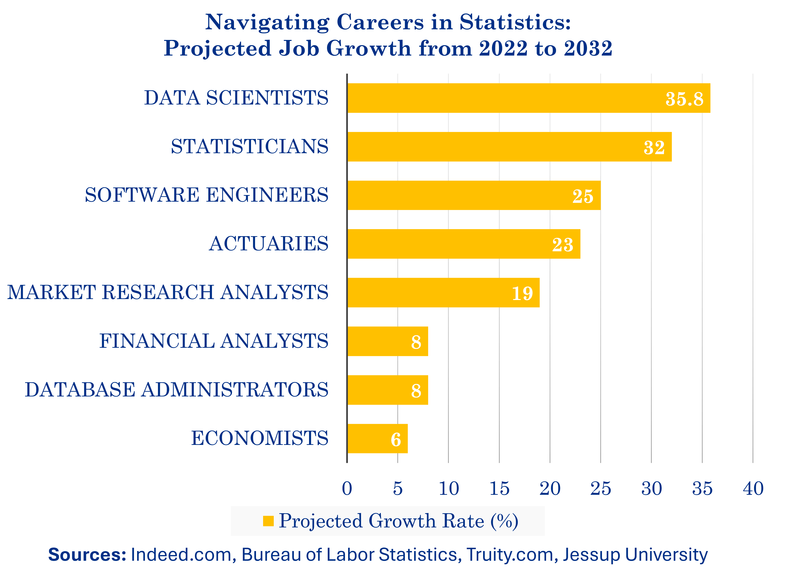

```{r setup, include=FALSE}
knitr::opts_chunk$set(cache = TRUE,
                      echo = FALSE,
                      warning = FALSE,
                      message = FALSE,
                      progress = FALSE, 
                      verbose = FALSE,
                      dev = 'png',
                      fig.height = 3,
                      dpi = 300,
                      fig.align = 'center')

options(htmltools.dir.version = FALSE)


if(require(pacman)==FALSE) install.packages("pacman")
if(require(devtools)==FALSE) install.packages("devtools")
if(require(countdown)==FALSE) devtools::install_github("gadenbuie/countdown")
if(require(xaringanExtra)==FALSE) devtools::install_github("gadenbuie/xaringanExtra")
if(require(emo)==FALSE) devtools::install_github("hadley/emo")
if(require(icons)==FALSE) devtools::install_github("mitchelloharawild/icons")

pacman::p_load(tidyverse, magrittr, lubridate, janitor, # data analysis pkgs
               emojifont, emo, RefManageR, xaringanExtra) # for
```

```{r xaringan-themer, include=FALSE, warning=FALSE}
if(require(xaringanthemer) == FALSE) install.packages("xaringanthemer")
library(xaringanthemer)

style_mono_accent(base_color = "#84d6d3",
                  base_font_size = "20px")

xaringanExtra::use_extra_styles(
  hover_code_line = TRUE,         
  mute_unhighlighted_code = TRUE  
)

xaringanExtra::use_xaringan_extra(c("tile_view", "animate_css", "tachyons", "panelset", "share_again", "search", "fit_screen", "editable", "clipboard"))

```


## Who am I?

.Large[Ying-Ju Tessa Chen, Associate Professor in Statistics]

### Academic Background
- **Two master’s degrees**:
  - Mathematics, National Taiwan University
  - Statistics, Bowling Green State University
- **Ph.D. in Statistics (2015)** – Bowling Green State University

### Professional Experience
- **Before I came to UD**:  
  Visiting Assistant Professor at Farmer School of Business, Miami University (Information Systems & Analytics).
- **Teaching experience**:  
  15th year since coming to the USA.

---
### Research Interests

- Empirical Likelihood Method
- Change Point Analysis
- Applied Machine Learning
- Survival Analysis

  [Research Network](https://sites.google.com/a/udayton.edu/ychen4/publications/research-network?authuser=0)

### Connection to the Program

In my role at UD, I’ve had the privilege of helping to shape the **Statistics major** and **Data Analytics minor**, preparing students to apply their skills to real-world problems and pursue careers in data-centric fields.

---
## The Importance of Data in Today's World

- **Data is Everywhere**  
  From business decisions to healthcare advancements, data is shaping every industry. Companies rely on data to improve products, enhance customer experience, and make informed decisions.

- **Growing Demand for Data Professionals**  
  The demand for data scientists, statisticians, and data analysts has grown exponentially. According to the U.S. Bureau of Labor Statistics, data-related jobs are projected to grow by 36% between 2021 and 2031.

- **Statistics and Data Analytics: Essential Skills**  
  Both the **Statistics major** and the **Data Analytics minor** at UD perpare students with the critical skills needed to navigate and succeed in this data-centric landscape. These programs provide hands-on experience with cutting-edge tools and real-world data analysis, preparing students not only to meet industry demands but also to pursue advanced studies in statistics, data science, and related fields.


---
## Data Analytics Minor Overview

.pull-left[
- **Launched in:** Fall 2022

- **Develop essential skills in:**
  - Statistical reasoning
  - Data analysis & visualization
  - Programming & machine learning

- **Prepare for:**
  - Industry & academic applications
  - Working with diverse types of data
  - Conducting & communicating quality data analysis
]
.pull-right[

- **The Data Analytics Minor consists of four key courses:**

- MTH 208: Exploratory Data Analysis  
- MTH 209: Data Manipulation and Management  
- MTH 369: Regression Models for Data Analytics  
- MTH 415: Machine Learning for Data Analytics
]

---
### MTH 208: Exploratory Data Analysis

- Grasp fundamental EDA concepts and their role in data analysis
- Learn to identify key features and insights
- Communicate findings through quantitative and visual summaries
- Address data quality issues and consider ethical implications in data analysis
- [Former students' projects](https://sites.google.com/a/udayton.edu/ychen4/teaching/mth-208-exploratory-data-analysis/mth-208-student-projects?authuser=0)

### MTH 209: Data Manipulation and Management

- Work with diverse data structures
- Gain hands-on experience with statistical software
- Learn to manipulate, manage, and compute with data
- [Former students' projects](https://sites.google.com/a/udayton.edu/ychen4/teaching/mth-209-data-manipulation-and-management/mth-209-student-projects?authuser=0)

---

### MTH 369: Regression Models for Data Analytics

- Foundation in regression models
- Apply models to make data-driven predictions
- Widely used across industries

### MTH 415: Machine Learning for Data Analytics

- Study key statistical learning algorithms
- Focus on classification, prediction, and decision making
- Learn cutting-edge tools driving today’s automation

---
## Statistics Major Overview

**Dive into the data-driven world of statistics.**  
Launched in Fall 2024, the Bachelor of Science in Statistics equips you with essential knowledge in statistical methods, data management, and computational tools, preparing you for a wide range of careers in data analysis.

### Program Structure

**15 courses | 46 credits**  
Gain comprehensive statistical, analytical, and computational skills applicable across industries.

- **Core Areas:**
  - **Statistical Theory**: Master foundational and advanced statistical principles.
  - **Applied Statistics**: Solve real-world problems using statistical techniques.
  - **Data Analytics**: Develop advanced data analysis skills with the latest tools.

---

### Unique Features

- **Interdisciplinary Opportunities**:  
  Apply statistical methods across various fields like economics and engineering.
  
- **Hands-On Learning**:  
  Practical experience through internships, project-based learning, and research.

- **Advanced Research Focus**:  
  Conduct high-level research under experienced faculty.

- **Customizable Coursework**:  
  Tailor your education with flexible electives to suit your career goals.

- **Community & Professional Engagement**:  
  Connect with professionals and alumni through clubs, seminars, and events.

---
## Projected Job Growth from 2022 to 2032

```{r, fig.align='center', out.width="70%"}

```

---
## Q&A

.pull-left[
.center[.Large[.red[Questions?]]]

- Feel free to reach out with any additional questions or for further discussion!
- Contact me, Tessa Chen, via email <a href="mailto:ychen@udayton.edu"><i class="fa fa-paper-plane fa-fw"></i>&nbsp; ychen4@udayton.edu</a> for questions or further discussions.
]


.pull-right[

```{r tessa, echo=FALSE, out.width="60%", fig.height=5}
knitr::include_graphics("./figs/Tessa_grey_G.gif")
```
]

