```{r setup, include=FALSE}
knitr::opts_chunk$set(cache = TRUE,
                      echo = FALSE,
                      warning = FALSE,
                      message = FALSE,
                      progress = FALSE, 
                      verbose = FALSE,
                      dev = 'png',
                      #fig.height = 3,
                      dpi = 300,
                      fig.align = 'center')

options(htmltools.dir.version = FALSE)

if(require(pacman)==FALSE) install.packages("pacman")
if(require(devtools)==FALSE) install.packages("devtools")
if(require(countdown)==FALSE) devtools::install_github("gadenbuie/countdown")
if(require(xaringanExtra)==FALSE) devtools::install_github("gadenbuie/xaringanExtra")
if(require(emo)==FALSE) devtools::install_github("hadley/emo")
if(require(icons)==FALSE) devtools::install_github("mitchelloharawild/icons")

pacman::p_load(tidyverse, # data analysis pkgs
               DataExplorer, scales, plotly, calendR, pdftools, RColorBrewer,# plots
               #tmap, sf, urbnmapr, tigris, # maps
               #gifski, av, gganimate, ggtext, glue, extrafont, # for animations
               emojifont, emo, RefManageR, xaringanExtra, countdown,
               basemodels, 
               knitr, kableExtra)
```

```{r xaringan-themer, include=FALSE, warning=FALSE}
if(require(xaringanthemer) == FALSE) install.packages("xaringanthemer")
library(xaringanthemer)

style_mono_accent(base_color = "#84d6d3",
                  base_font_size = "20px")

xaringanExtra::use_extra_styles(
  hover_code_line = TRUE,         
  mute_unhighlighted_code = TRUE  
)

xaringanExtra::use_xaringan_extra(c("tile_view", "animate_css", "tachyons", "panelset", "share_again", "search", "fit_screen", "editable", "clipboard"))

```


## Who am I?

.Large[Ying-Ju Tessa Chen, Associate Professor in Statistics, University of Dayton]

.pull-left-2[
### Academic Background
  - B.S. in Applied Mathematics (2000), National Chung-Hsing University, Taiwan
  - M.A. in Mathematics (2003), National Taiwan University
  - M.S. in Statistics (2011), Bowling Green State University
  - PhD in statistics (2015), Bowling Green State University
]

.pull-right-2[
```{r Tessa, echo=FALSE, fig.align='center', out.width="75%"}

```
]

---
.pull-left-2[
### Professional Experience
- **Before I came to UD**:  
  Visiting Assistant Professor at Farmer School of Business, Miami University (Information Systems & Analytics).
- **Teaching experience**:  
  - 15th year since coming to the USA.
  - `Classroom Teaching:` Since joining the University of Dayton in the Fall of 2017, I have taught 13 different courses in Statistics and Mathematics, including Data Analytics, and a total of 28 sections.
- **Mentoring**
  - `Advisor for` [Data Analytics Club](https://1850.udayton.edu/dac/home/)
  - `Capstone Advisor:` for 16 students.
  - `Mathematics Clinic (Master's Thesis) Advisor:` for 3 students.
]

.pull-right-2[
<br>
```{r MTH208, echo=FALSE, fig.align='center', fig.width=5}
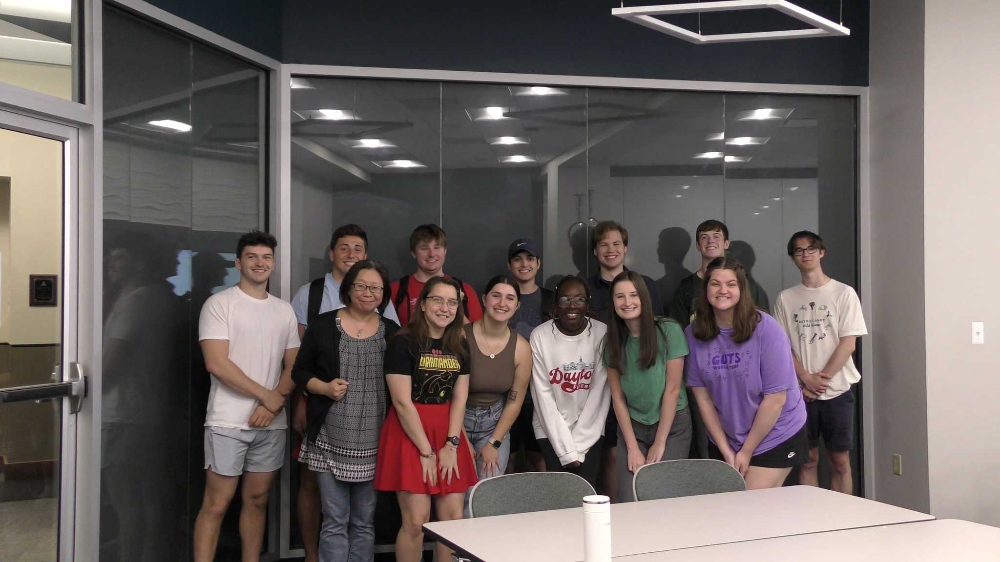
```

<br>

```{r capstone, echo=FALSE, fig.align='center', fig.width=5}
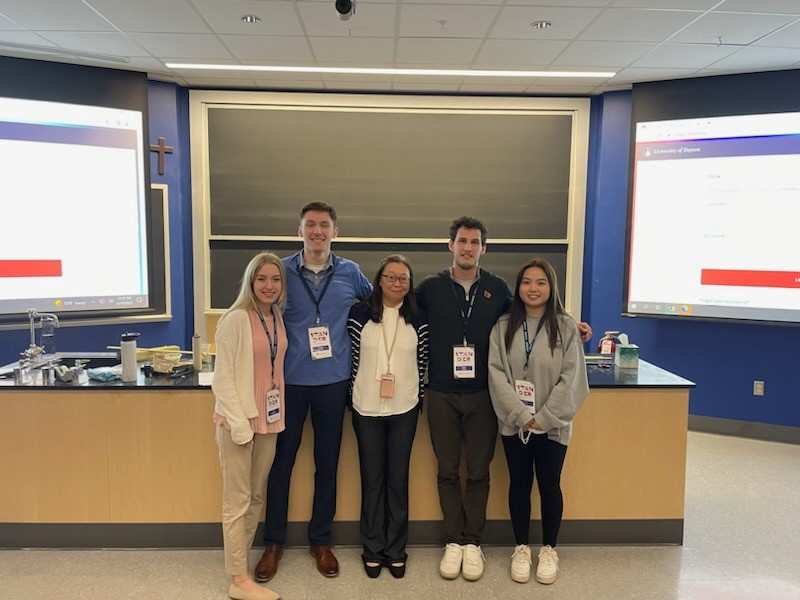
```
]

---
### Research Interests

.pull-left[
- Statistics modeling and its applications
- Data Science applications in manufacturing, healthcare operations, and transportation safety. 
- I am dedicated to working on research related to people's daily lives and well-being. 
]
.pull-right[
```{r research, echo=FALSE, out.width="100%"}
include_url("https://sites.google.com/a/udayton.edu/ychen4/publications/research-network?authuser=0", height="500px")
```
]

---

## Living in the United States

### Cultural differences

- **Communication styles**  
.small[
  - `Listen first:` People appreciate thoughtful responses, and it's common to let the other person finish before contributing. 
- `Direct vs. Indirect Communication:` Americans, in general, tend to be more direct in their communication. 
- `Asking Questions:` Asking questions is encouraged and seen as a sign of engagement. 
- `Non-verbal Cues:` Body language, eye contact, and facial expressions are important. 
]

- **Social norms**  
.small[
  - `Individualism vs. Collectivism:` The U.S. places a high value on individualism, where personal goals and independence are emphasized. 
- `Punctuality:` Being on time for meetings, classes, or social events (e.g., weddings, funerals, etc.) is crucial. 
- `Small Talk:` Americans often engage in small talk (e.g., weather, sports, or weekend plans) as a way to build rapport. 
- `Personal Space:` People in the U.S. tend to maintain more personal space during conversations. Individuals often leave some distance between themselves and others. 
]

---

.pull-left-2[
- **Daily life differences**  
.small[
  - `Public Transportation vs. Driving:` In many parts of the U.S., driving is the primary mode of transportation. 
- `Dining Etiquette:` Tipping is a big part of U.S. dining culture. It's standard to tip 15-20% in restaurants. 
- `Holidays and Celebrations:` Most major U.S. holidays are in the fall and winter seasons. 
]

### Adapting to new environments

- **Challenges I faced **
.small[
- Learning to Cook
- Overcoming Language Barriers
    - Listen to conversations to pick up natural phrasing.
    - Listen to radios/podcasts for different accents and vocabulary.
    - Watch TV shows or news to hear real-life dialogue.
    - Learn from how your professors communicate during lectures.
    - Talk to your neighbors or classmates, if possible.
]
]
.pull-right-2[
<br>
```{r USA_Life, echo=FALSE, fig.align='center', out.width="80%"}

```

<br> 


```{r cook, echo=FALSE, fig.align='center', out.width="80%"}

```

<br>


**Lazy people must know a way to survive!** `r emo::ji("smile")`
]


---
### Building a community

.pull-left-2[
- **Finding support networks**
.small[   
- Taiwanese Student Association or local Taiwanese associations
- Student Clubs
  ]

- **Making friends**
.small[  
- Be Open and Approachable
- Joining Group Activities
- .purple[Diversity of Friendships]
  ]
  
- **Staying connected to our cultural roots**
.small[  
- Celebrate Traditions
- Staying in Touch with Family and Friends Back Home
  ]
]

.pull-right-2[
```{r put_in_bay, echo=FALSE, fig.align='center', out.width="80%"}
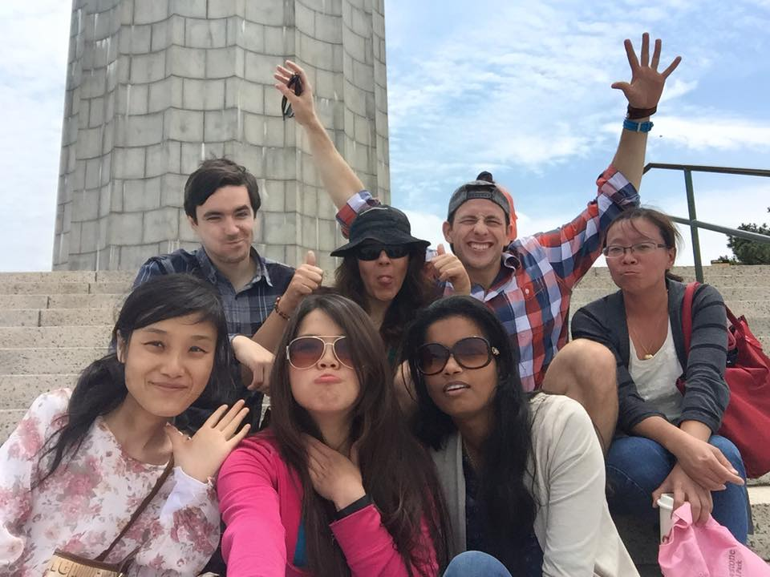
```

<br>
<br>

```{r taiwanese2, echo=FALSE, fig.align='center', out.width="80%"}
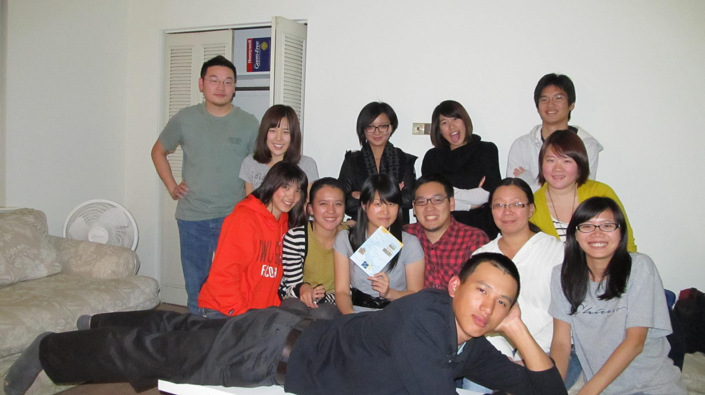
```
]

---
## Studying in the U.S.

.pull-left-2[
### Academic differences

- **Structures between Taiwan and the U.S. **
.small[
- `Teaching Styles:` Classes tend to be more interactive. 
- `Class Expectations:` Students are typically expected to be active learners, which includes contributing to class discussions, asking questions, and working on group projects. 
- `Independent Learning:` Students often have more assignments and exams. 
  ]
]
.pull-right-2[
```{r Gupta, echo=FALSE, fig.align='center', out.width="75%"}
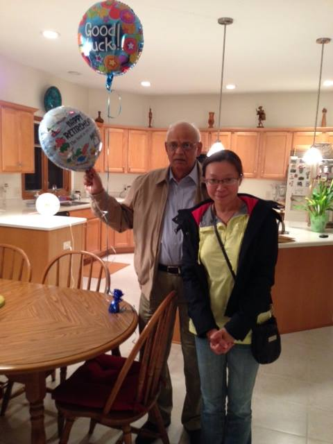
```
]

---
### Graduate studies

.pull-left-2[
- **Process of applying for graduate programs**
.small[
- `Application Requirements:` U.S. graduate programs usually require a combination of 
    1. academic transcripts, 
    2. standardized test scores (e.g., GRE, TOEFL/IELTS for international students), 
    3. recommendation letters, 
    4. a statement of purpose, 
  
  and sometimes a resume or CV. Each program may have specific requirements, so it's important to carefully review them. 

- `Researching Programs:` It is essential to find programs that align with personal and academic goals.
- `Funding Opportunities:` Teaching or Research assistantships, fellowships, or scholarships. 
  ]
]
.pull-right-2[
```{r Albert, echo=FALSE, fig.align='center', out.width="75%"}
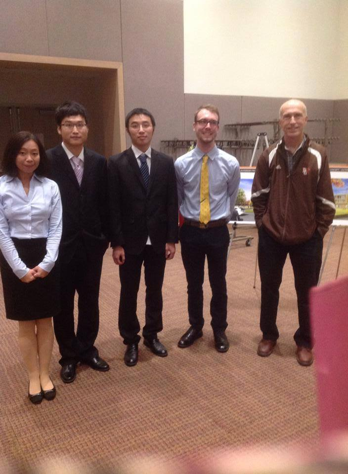
```
]
---
.pull-left-2[
- **Differences in academic culture**
.small[
- `Professor-Student Relationship:`  In U.S. graduate programs, relationships with professors tend to be less formal than in Taiwan. Professors often take on a mentorship role. 
- `Thesis or Qualifying Exams:` Many U.S. graduate programs require students to either complete a thesis or pass a qualifying exam to graduate. Some master's programs allow students to complete coursework-only degrees without a thesis or qualifying exam, which is more common in professional or applied fields. 
- `Collaboration and Networking:` Collaboration among peers and faculty is encouraged, through group work, discussions, and networking at conferences.
  ]
  
- **How to succeed in U.S. academic**
.small[
- Time Management and Self-Motivation
- Active Participation
- Publishing and Presenting Research
]
]

.pull-right-2[
<br>
<br>

```{r teaching_award, echo=FALSE, fig.align='center', out.width="80%"}
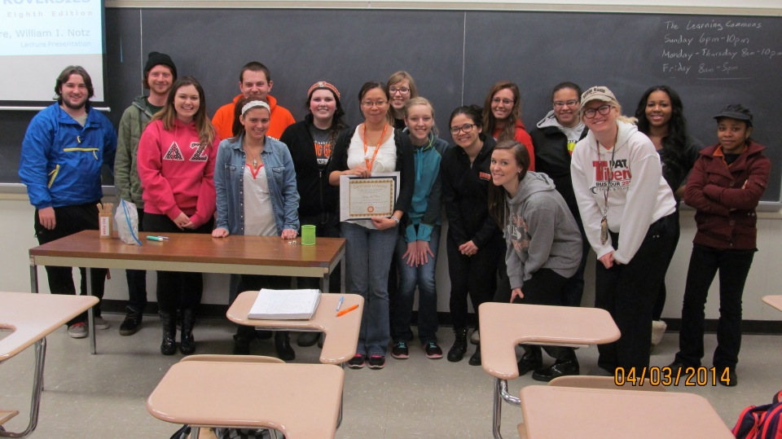
```

<br>

```{r mytable, echo=FALSE, fig.align='center', out.width="80%"}
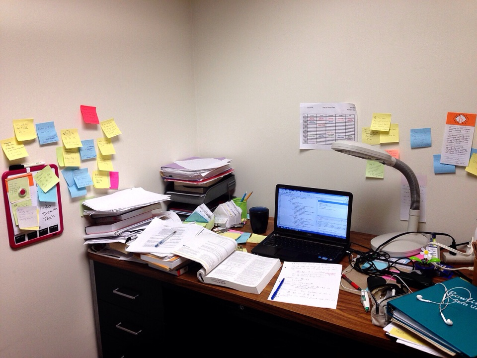
```
]

---
### Research opportunities

- **Where to get involved in research**
.small[
- `Work hard for class projects:` They are great showcases for what you have done.
- `Talk to your professors:` They are often the best resources for finding research opportunities.
- `Campus job platforms:` Many universities post research assistant positions on job platforms specific to their campus.
- `Read emails:` Keep an eye on department emails or newsletters for announcements about research opportunities, internships, or assistantships. 
]

- **Additional Tips for Finding Research Opportunities**
.small[
- `Attend Research Seminars:` Many campuses host research seminars where professors and students present their work. Attending these can help you learn about research areas of interest and make connections.
- `Participate in the Statistical Consulting Center:` Many universities with a Statistics department offer a Statistical Consulting Center where students can assist faculty, staff, and external clients with real-world data analysis problems. It's a great way to apply what you’ve learned and gain practical experience.
]

<br>

.center[
**Work hard & Work Smart!**
]

---
## Working in the U.S. 

.pull-left-2[
### Job market and work culture
- **Transition from studying to working**
.small[
- Applying Academic Skills in the Workplace
- Internships and Entry-Level Roles
- Learning Professional Etiquette
  - Email communication
  - Meetings
  - Deadlines
]
- **Key differences in work culture compared to Taiwan**
.small[
- Work-Life Balance
- Initiative and Independence
- Feedback and Evaluation
]
]

.pull-right-2[

]

---
### Challenges and opportunities

.pull-left-2[
- **Visa issues **
.small[
- `Patience and Timing:` Navigating the visa process can be time-consuming, and it’s often best to discuss visa-related concerns after receiving a job offer. Stay patient throughout the process.
- `Employer Sponsorship:` Look for employers familiar with sponsoring international workers for visas like H-1B or OPT extensions. Some industries and companies are more open to sponsoring than others.
]
- **Professional networking**
.small[
- `Be Open-Minded:` An open mind and willingness to meet new people can lead to unexpected opportunities.
- `Mentorship:` Seek out mentors who can guide you through the professional landscape and provide advice on career development.
]
]
.pull-right-2[

]

---
.pull-left-2[
- **Adapting to the corporate culture**
.small[
- `Workplace Diversity:` U.S. companies often emphasize diversity and inclusion, creating opportunities to work with people from different backgrounds and perspectives.
- `Corporate Communication:` Be prepared for a more direct communication style, especially in meetings or discussions. 

<br>
<br>

```{r miami1, echo=FALSE, fig.align='center', out.width="75%"}
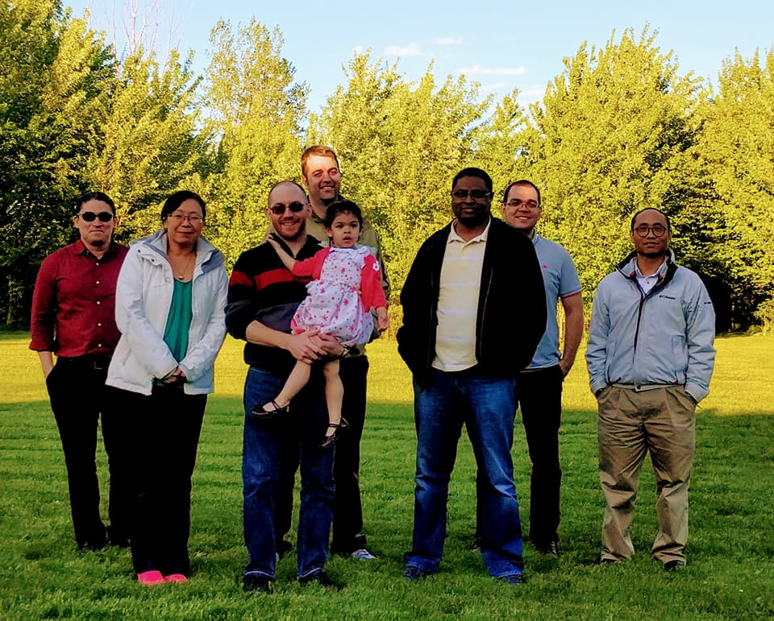
```
]
]
.pull-right-2[
<br>
<br>
<br>
<br>

```{r miami2, echo=FALSE, fig.align='center', out.width="75%"}
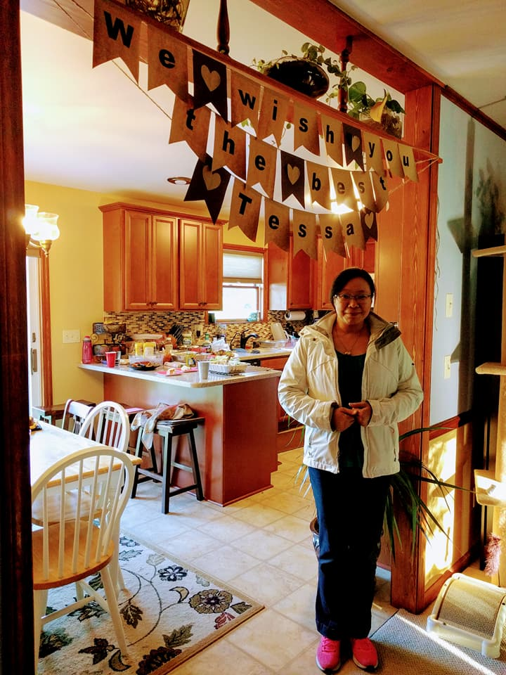
```
]

---
### Tips for career growth
.pull-left-2[
- **Continuous Learning**
.small[
- `Be an Active Learner:` Keep expanding your skills through professional development, whether that’s taking courses, attending workshops, or staying current with industry trends.
- `Adaptability:` The ability to adapt to new technologies, tools, and trends is crucial for long-term career growth in any field.
]

- **Openness to Feedback**
.small[
- `Embrace Constructive Criticism:` Regular feedback is a part of U.S. workplace culture, so view constructive criticism as an opportunity for growth.
- `Show Initiative:` Demonstrating initiative and a willingness to take on challenges can set you apart from your peers and help you advance in your career.
]
]
.pull-right-2[
```{r allpass, echo=FALSE, fig.align='center', out.width="65%"}
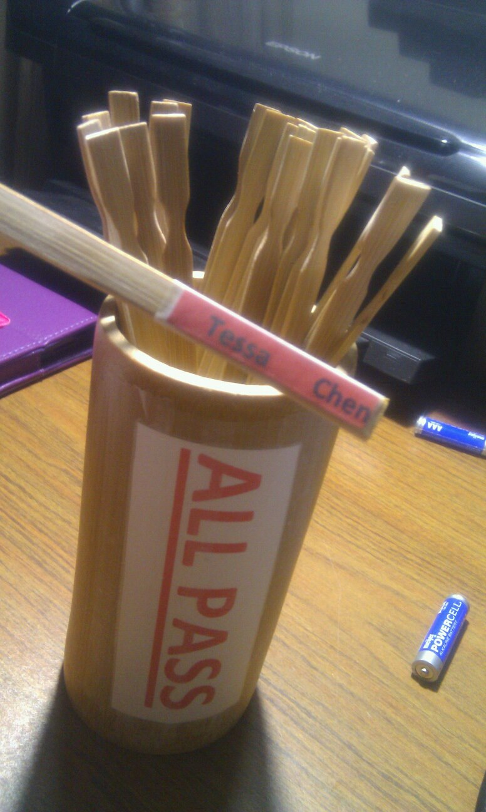
```

]

---
## Key Takeaways

.pull-left-2[
- **Adapting to Life in the U.S.:** Embrace cultural differences and be open to learning from new experiences, whether in communication, daily life, or building a community.
- **Studying in the U.S.:** Independent learning and active participation are crucial. Be prepared for more assignments, frequent assessments, and research opportunities.
- **Working in the U.S.:** Transitioning from student life to the workplace requires adapting to new work cultures, networking, and continuous learning for career growth.
- **Opportunities:** Whether through research, networking, or internships, take advantage of every opportunity to build your skills and make connections.
]
.pull-right-2[
<br>
<br>

```{r flower, echo=FALSE, fig.align='center', out.width="80%"}
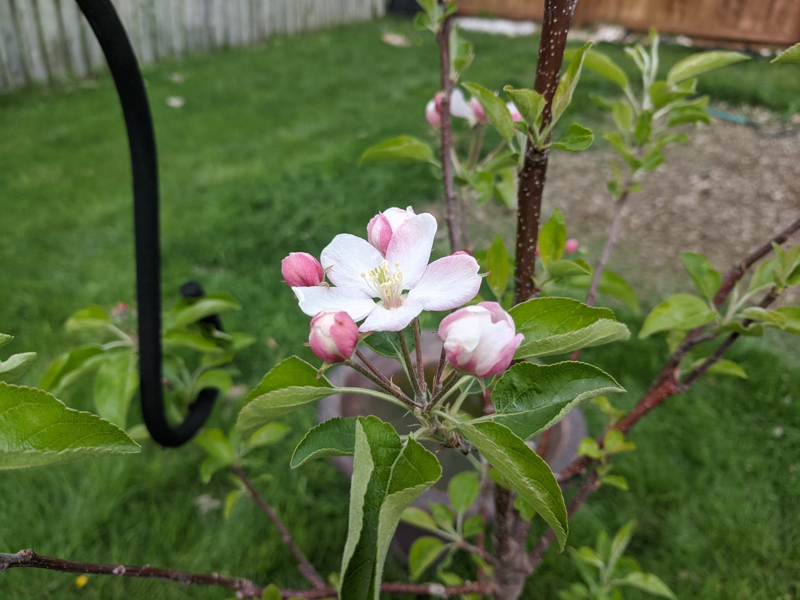
```
]

---
## Q&A


---
## Thank You!

.pull-left[
<br>
<br>
- Please do not hesitate to contact me (Tessa Chen) at <a href="mailto:ychen@udayton.edu"><i class="fa fa-paper-plane fa-fw"></i>&nbsp; ychen4@udayton.edu</a> for questions or further discussions.
]


.pull-right[

```{r tessa, echo=FALSE, out.width="60%", fig.height=5}
knitr::include_graphics("./figs/Tessa_grey_G.gif")
```
]

