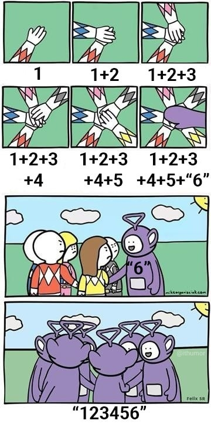

  
```{r setup, include=FALSE}
knitr::opts_chunk$set(cache = TRUE,
                      echo = TRUE,
                      warning = FALSE,
                      message = FALSE,
                      progress = FALSE, 
                      verbose = FALSE,
                      dev = 'png',
                      fig.height = 2.5,
                      dpi = 300,
                      fig.align = 'center')

options(htmltools.dir.version = FALSE)

daytonred = '#E4002B'

if(require(pacman)==FALSE) install.packages("pacman")
if(require(devtools)==FALSE) install.packages("devtools")

if(require(countdown)==FALSE) devtools::install_github("gadenbuie/countdown")
if(require(xaringanExtra)==FALSE) devtools::install_github("gadenbuie/xaringanExtra")


pacman::p_load(lubridate, janitor, magrittr,
               tidyverse, # data analysis pkgs
               countdown, fontawesome, RefManageR, 
               xaringanExtra, # for slides
               gifski, av, # for animations
               rvest, # for scraping
               scales # for the comma function
               ) 

BibOptions(check.entries = FALSE, bib.style = "authoryear", 
           style = "markdown", dashed = TRUE)

bib = ReadBib("../Styles/MTH209.bib") 
```

```{r xaringan-themer, include=FALSE, warning=FALSE}
if(require(xaringanthemer) == FALSE) install.packages("xaringanthemer")
library(xaringanthemer)

style_mono_accent(base_color = "#84d6d3",
                  base_font_size = "16px")

xaringanExtra::use_xaringan_extra(c("tile_view", "animate_css", "tachyons", "panelset", "broadcast", "share_again", "search", "fit_screen", "editable", "clipable"))

```

# Learning Objectives

- Basic Syntax

- Basic Data Types

---
## Basic Syntax

We will introduce some basic syntax in R. 

- Pound Sign in R
- Simple Algebra
- Assignment Operator
- Parentheses, Brackets & Curly Brackets

### Pound Sign in R

\# symbol is for adding comments and notes to your code.  In any line of your code, anything after it will not be executed. 

```{r poundsign}
# Hello, UD students!
```

---
## Examples of Simple Algebra

- Example of Addition

```{r addition, eval=FALSE}
7+11
7-11
7 - 11
```

- Example of Multiplication & Division

```{r multiplication, eval=FALSE}
7*11
7/11
7 / 11
```

**Note:** you should find that 7/11 and 7 / 11 generate the same result.  This is because the blank spaces in the code is generally ignored.  

---
## Assignment Operators: Equal Sign and Arrow

.pull-left[
```{r equal, eval=FALSE}
a1 = 7
b1 = 11
```

```{r arrow, eval=FALSE}
a2 <- 7
11 -> b2
```

What's difference between Equal Sign and Arrow in R?

```{r diff_arrow_equal1, error=TRUE, results=FALSE}
mean(x = c(1, 8, 4, 9, 13))
```
```{r show_x1, error=TRUE}
x
```
]

.pull-right[
```{r diff_arrow_equal2, error=TRUE, results=FALSE}
mean(x <- c(1, 8, 4, 9, 13))
```

```{r show_x2}
x
```

In the first case, $x$ is an argument in the function <span Style="color:blue">mean()</span> while the second case assigns a vector $(1, 8, 3, 9, 13)$ to $x$ and then finds the mean value of it. 

<p style="color:red">We should use <mark style="background-color: lightblue"><-</mark> as an assignment operator and <mark style="background-color: lightblue">=</mark> for function arguments! </p>
]

---
## Parentheses, Brackets & Curly Brackets

Parentheses, <mark style="background-color: lightblue">( )</mark>, are used to call functions; Brackets, <mark style="background-color: lightblue">[ ]</mark>, are used to obtain values in a data structure, Curly Brackets, <mark style="background-color: lightblue">{ }</mark>, are used to denote a block of code in a function or in a conditional statement.  

Here, we give examples about the use of ( ) and [ ]. The use of curly brackets will be introduced later. 

```{r pars, results=FALSE}
w <- c(17, 57, 69, 50, 100, 68, 29, 16, 65, 5, 15, 25) # c() combines objects
median(w) # find the median of w
w[3] # find the value of the third element in w
w[1:2] # find the values of the first and second elements in w
w[2:4] # find the values between the second and the fourth elements in w
w[c(2,5,8)] # only find the values of the second, fifth and eighth elements in w
w[-5] # the fifth element in w is removed
w[w < 50] # only obtain values that satisfy the condition
```

**Note:** c() can concatenate more than just vectors.  We will talk about this later. 

---
## Basic Data Types

Here are some basic data types in R.

- Character
- Factor
- Numeric
- Integer
- Logical
- Complex

We will focus on the use of the first five types. 

---
## Character - 1

A character object is used to store text, letters, or words (strings) in R.

```{r character}
x <- "Hello"
y <- "UD students!"
class(x) # we can use class() function to obtain the data type
nchar(x) # use nchar() to count the number of characters
```

**Note:** When defining strings, double quotes " " and single quotes ' ' are interchangeably but double quotes are preferred (and character constants are printed using double quotes), so single quotes are normally only used to delimit character constants containing double quotes.
.left[.footnote[[R: Quotes](https://stat.ethz.ch/R-manual/R-devel/library/base/html/Quotes.html)]]

---
## Character - 2

If we want to combine two strings into one string, we can use paste() or paste0() function. 

.pull-left[
```{r paste}
paste(x,y)
paste(x,y,sep=",")
paste(x,y,sep=", ")
```
]
.pull-right[
```{r paste0}
paste(x, ", ", y)
paste0(x,y)
```
]

.center[These two functions could be very useful.]  

---
## Character - 3

Here we give one advanced example. 

```{r paste_example}
allfiles1 <- paste("file_", 1:5)
allfiles2 <- paste("file_", 1:5, collapse = "_")
allfiles3 <- paste("file", 1:5, sep = "_")
allfiles1
allfiles2
allfiles3
```

---
## What is wrong here?

```{r rstudio, echo=FALSE, fig.align = 'center', out.width="25%"}
   
```

---
## Factor - 1

A factor object is used to store categorical / qualitative variables. 

```{r factor}
grade <- factor(c("A", "C", "B", "B-", "A", "C+", "D", "A-", "B+", "C-", "B"))
gender <- c("M", "F", "F", "M", "M", "M", "F", "M", "F")
gender <- as.factor(gender)
class(gender)
levels(gender) # use levels() to find all categories in the variable
length(grade) # use length() to find the length of vectors 
```

---

## Factor - 2

- Question 1: Is factor the same as character in R?
  - No, they are not the same
  
- Question 2: How do we convert factor to character?
  - Use <span Style="color:blue">as.character()</span> function

---
## Numeric

A numeric object is used to store numeric data in R.

```{r numeric, results=FALSE}
x1 <- 3
x2 <- c(-3.13, 2.47, 6, -1.5, 4.29, 2.72, 1, 0, 3.85)
class(x1)
class(x2)
sum(x2)
max(x2)
min(x2)
range(x2)
round(x2) # round off the values
ceiling(x2) # round up to the nearest integer
floor(x2) # round down to the nearest integer
summary(x2)
```

---
## Integer 

An integer object is used to store numeric data without decimals.

```{r integer}
x2 <- c(-3.13, 2.47, 6, -1.5, 4.29, 2.72, 1, 0, 3.85)
x3 <- as.integer(x2) # only remain the integers
x3
class(x3)
```

---
## Logical

A logic object contains only two values: TRUE or FALSE.

.pull-left[
```{r logic1}
y1 <- -7
y2 <- 11
y1 > y2
# check if two objects are the same
y1 == y2  
```
]
.pull-right[
```{r logic2}
y1 <= y2
result <- y1 > y2
class(result)
```
]

---
## Create an empty vector

There are some situations that we may want to create an empty vector.  Here is a simple example. 

```{r empty}
x <- c()
y1 <- vector("character", length=3)
y2 <- character(3)
z1 <- vector("numeric", 5)
z2 <- numeric(5)
w <- rep(NA, 2)
```

---
## Remark 

We can use `as.character()`, `as.integer()`, `as.numeric()`, `as.factor()` functions to transform the data type. 

.pull-left[
```{r as1}
z1 <- as.integer(c(3, 5.8))
class(z1)
# transform integer object to character
z2 <- as.character(z1) 
z2
```
]
.pull-right[
```{r as2}
# transform logical object to numbers
as.numeric(3 > 8)  
gender <- factor(c("M", "F", "F", "M", "M"))
# transform levels to numbers
as.numeric(gender)
```
]

.small[
**Note:** as.numeric() function can transform logical object to numeric values: TRUE: 1 and FALSE: 0.]

---
# Summary of Main Points

By now, you should know 

- Basic Syntax in R

- Usage of Different Brackets

- Basic Data Types

- How to Convert Variables to Different Data Types


---
# Supplementary Materials

Here are some useful supplementary materials for self-learning. 

.pull-left[
.center[[](https://r4ds.had.co.nz)]
.small[
* [Workflow: basics](https://r4ds.had.co.nz/workflow-basics.html)
]
]
.pull-right[
.center[[](https://RPubs.com)]
.small[
* [Data types in R](https://rpubs.com/STEMResearch/data-types-in-r)
]
]
