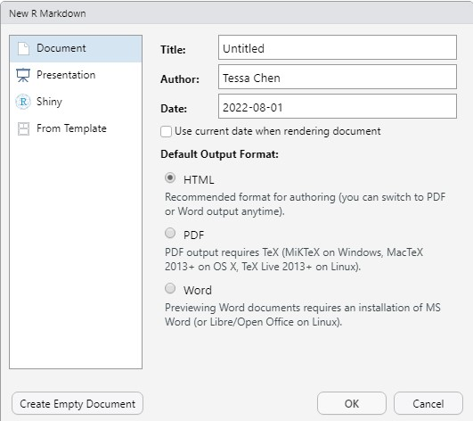
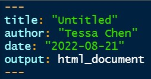

  

```{r setup, include=FALSE}
knitr::opts_chunk$set(cache = TRUE,
                      echo = TRUE,
                      warning = FALSE,
                      message = FALSE,
                      progress = FALSE, 
                      verbose = FALSE,
                      dev = 'png',
                      fig.height = 2.5,
                      dpi = 300,
                      fig.align = 'center')

options(htmltools.dir.version = FALSE)

daytonred = '#E4002B'

if(require(pacman)==FALSE) install.packages("pacman")
if(require(devtools)==FALSE) install.packages("devtools")

if(require(countdown)==FALSE) devtools::install_github("gadenbuie/countdown")
if(require(xaringanExtra)==FALSE) devtools::install_github("gadenbuie/xaringanExtra")


pacman::p_load(lubridate, janitor, magrittr,
               tidyverse, # data analysis pkgs
               countdown, fontawesome, RefManageR, 
               xaringanExtra, # for slides
               gifski, av, # for animations
               rvest, # for scraping
               scales # for the comma function
               ) 

BibOptions(check.entries = FALSE, bib.style = "authoryear", 
           style = "markdown", dashed = TRUE)

bib = ReadBib("../Styles/MTH209.bib") 
```

```{r xaringan-themer, include=FALSE, warning=FALSE}
if(require(xaringanthemer) == FALSE) install.packages("xaringanthemer")
library(xaringanthemer)

style_mono_accent(base_color = "#84d6d3",
                  base_font_size = "16px")

xaringanExtra::use_xaringan_extra(c("tile_view", "animate_css", "tachyons", "panelset", "broadcast", "share_again", "search", "fit_screen", "editable", "clipable"))

```

# Learning Objectives

- Know basis of R, RStudio, and RMarkdown

- Know typical R format files

- Learn some useful keyboard shortcuts

- Know where to get help

---
## What is R?

[R](https://www.r-project.org/) is a statistical programming language. Developed by statisticians Ross Ihaka and Robert Gentleman, R is one of the most popular programming languages in the industry. It is used in almost everywhere, ranging from finance and banking to medicine and manufacturing. It can be used in disciplines like statistics, computer science, economics and economic modelling, cyber security, information systems, health care, engineering and so on.


To update R, run the following code. 

```{r Rupdate, eval=FALSE}
# Install installr (if not already installed)
if(require(installr)==FALSE) install.packages("installr") 

# using the package
require(installr)

# update R to the latest version
updateR()
```

---
## RStudio

[RStudio](https://www.rstudio.com/products/rstudio/) is an integrated development environment (IDE) for R. 

```{r rstudio, echo=FALSE, fig.align = 'center', out.width="70%"}
   knitr::include_graphics('../Figures/rstudio.jpg')
```

---
## What is R markdown?

R Markdown is a file format for creating dynamic documents with R and RStudio. RMarkdown documents are written in Markdown which has easy-to-write plain text format with embedded R code.

.pull-left[

In order to create a Rmarkdown document, we click <span Style="color:#3384FF">File</span> and then find <span Style="color:#3384FF">New File</span>, <span Style="color:#3384FF">R markdown ...</span>, and <span Style="color:#3384FF">Document</span>. There are three options:

- HTML 
- PDF (Its output requires TeX.)
- Word (It requires an installation of MS Word.)
]
.pull-right[
```{r rmarkdown, echo=FALSE, fig.align = 'center', out.width="85%"}
   
```
]

---
## An Overview of R Markdown Documents

.pull-left[In the following, we show an example of the header of a R markdown file. 

```{r rmd_setting, echo=FALSE, fig.align = 'center', out.width="50%"}
   
```

We can use the output option to manipulate which document we would like to have. 

- html_document
- pdf_document
- word_document
]
.pull-right[
To render a R Markdown document into its final output format, we can click the <span Style="color:#3384FF">Knit</span> button to render the document in RStudio and RStudio will show a preview of it. The corresponding output file is saved in the folder where the markdown file is. 

The further settings for presentations could be found at [R Markdown Cookbook](https://bookdown.org/yihui/rmarkdown-cookbook/) and [R Markdown: The Definitive Guide](https://bookdown.org/yihui/rmarkdown/pdf-document.html#figure-options-1).
]

---
## Typical R File Formats

.small[
- `.R` or `.r`: This is the standard file extension for R scripts. 

- `.RData` or `.rda`: These files store R objects in a serialized format. We can save workspace in R using the `save()` function or at the end of an R session. These objects can be reloaded into an R session using the `load()` function.

- `.Rds`: This is a file format for storing a single R object. Objects can be saved in this format using the `saveRDS()` function and read back using `readRDS()`.

- `.Rproj`: This is specific to RStudio, an Rproj file marks the root of an RStudio project and stores settings related to that project.

- `.Rmd`: R Markdown files. 

- `.Rnw`: This is a mix of LaTeX (for math equations) and R used for creating dynamic reports. 

- `.Rhistory`: This file stores the command history for an R session, allowing users to revisit or re-run previous commands.

- `.Rprofile`: This is a script that runs every time R starts. It is often used to set session-wide options or load specific libraries on startup.
]

---
## Some Useful Keyboard Shortcuts

.pull-left[
.small[
- **Ctrl-A** to select all items
- **Ctrl-C** to copy
- **Ctrl-F** to find text in a page
- **Ctrl-N** to start a new file in an editor
- **Ctrl-O** to open a file from the disk
- **Ctrl-S** to save
- **Ctrl-T** to open a new tab in a browser
- **Ctrl-V** to paste
- **Ctrl-X** to cut
- **Ctrl-Z** to undo
- **Alt-Tab** changes from window to window.  
- **Alt-=** to insert a new equation in MS Word
]
]

.pull-right[
.small[
- **Command-C** to copy
- **Command-F** to find text in a page
- **Command-N** to open a new Finder window
- **Command-O** to open a file from the disk
- **Command-S** to save
- **Command-V** to paste
- **Command-X** to cut
- **Command-Z** to undo
- **Command-Tab** changes from window to window.  
- **Ctrl-=** to insert a new equation in MS Word

See [Mac keyboard shortcuts](https://support.apple.com/en-us/HT201236) for more detail. 
]
]

---
## Where to Get Help

1. To see documentation on any **function** in R, execute `?data.frame` etc.
2. Google it! (Better way to learn coding!)
3. Ask questions online, for example: [stackoverflow.com](https://stackoverflow.com/questions/tagged/r).

> .fancy[How about some online chatbots such as [ChatGPT](https://chat.openai.com/auth/login) or [Google Bard](https://bard.google.com)? 
  - When could we use it, or should we not use it?
]

---
# Summary of Main Points

By now, you should know 

- Basis of R, RStudio, and R Markdown

- How to knit a R Markdown file

- Typical R File Formats

- Useful Keyboard Shortcuts

- Where to Get Help


---
# Supplementary Materials

Here are some useful reading materials for self-improvement. 

.pull-left[
.center[[](https://adv-r.hadley.nz)]
.small[
* [Why R?](https://adv-r.hadley.nz/introduction.html#why-r)
]
]
.pull-right[
.center[[](https://r4ds.had.co.nz)]
.small[
* [Workflow: scripts](https://r4ds.had.co.nz/workflow-scripts.html)
* [Workflow: project](https://r4ds.had.co.nz/workflow-projects.html)
]
]


