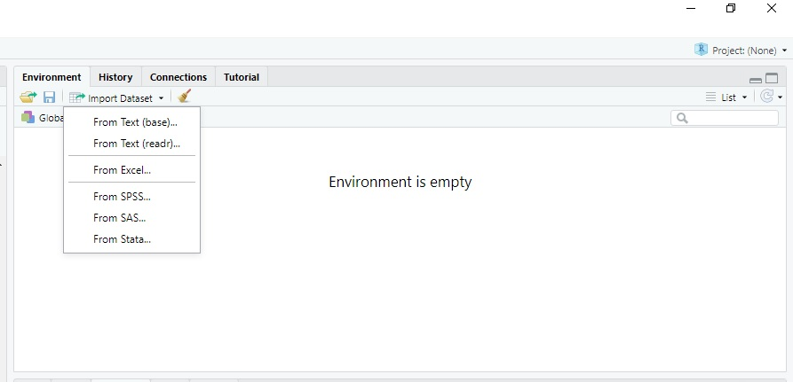

```{r setup, include=FALSE}
knitr::opts_chunk$set(cache = TRUE,
                      echo = TRUE,
                      warning = FALSE,
                      message = FALSE,
                      progress = FALSE, 
                      verbose = FALSE,
                      dev = 'png',
                      fig.height = 2.5,
                      dpi = 300,
                      fig.align = 'center')

options(htmltools.dir.version = FALSE)

daytonred = '#E4002B'

if(require(pacman)==FALSE) install.packages("pacman")
if(require(devtools)==FALSE) install.packages("devtools")

if(require(countdown)==FALSE) devtools::install_github("gadenbuie/countdown")
if(require(xaringanExtra)==FALSE) devtools::install_github("gadenbuie/xaringanExtra")


pacman::p_load(lubridate, janitor, magrittr,
               tidyverse, # data analysis pkgs
               countdown, fontawesome, RefManageR, 
               xaringanExtra, # for slides
               gifski, av, # for animations
               rvest, # for scraping
               scales # for the comma function
               ) 

BibOptions(check.entries = FALSE, bib.style = "authoryear", 
           style = "markdown", dashed = TRUE)

bib = ReadBib("../Styles/MTH209.bib") 
```

```{r xaringan-themer, include=FALSE, warning=FALSE}
if(require(xaringanthemer) == FALSE) install.packages("xaringanthemer")
library(xaringanthemer)

style_mono_accent(base_color = "#84d6d3",
                  base_font_size = "16px")

xaringanExtra::use_xaringan_extra(c("tile_view", "animate_css", "tachyons", "panelset", "broadcast", "share_again", "search", "fit_screen", "editable", "clipable"))

```

# Learning Objectives 

In this session, we will learn

- How to install and load R packages

- How to read and write csv files 

---

## R Packages

.small[
The commonly used units that people adopt to share code in R are `packages`. In general, a package contains code, data, documentation, tests, etc. Most people upload their packages to [CRAN](https://cran.r-project.org/), a comprehensive R Archive Network while a few people share their code on [GitHub](https://github.com/) or other web sites.  It is recommended that you ONLY download packages from CRAN since these packages are well-maintained. 

In order to import packages in RStudio, you need to 

  1. know the name of the package.

  2. download the package. Here, we introduce two basic methods:
    - In the Console window, run **install.packages("package's name")**. 
  
**Note:** It is essential to put the quotation marks around the package's name.]


---
## Installing Packages

.small[Click the **Packages** tab in RStudio (bottom right window) and then click .green[Install], find .green[Install From:] and select .green[Repository (CRAN)], type the name of the package in the box under **Packages (separate multiple with space or comma)** and click .green[Install].]
  
```{r cran, echo=FALSE, fig.align = 'center', out.width = "43%"}
   knitr::include_graphics('../Figures/CRAN.jpg')
```

.small[**Note:** we should leave **Install dependencies** checked so R will download any additional packages needed in order to use some functions or data in the package you are currently downloading. ]

---
## Loading Packages

.small[Use .green[library()] or .green[require()] function to import the package you would like to use. Here, we show how to install the package .flyerblue[tidyverse] which is designed for data science and how to import it. ] 

```{r packages, eval=FALSE}
install.packages("tidyverse")
library(tidyverse)
```

.small[
**Note:** 

  1. Sometimes, warning messages are given in the Console when installing certain packages indicating that the package was built using an older version of R.  In general, these warnings can be ignored since they are still compatible with newer versions of R.
  
  2. You only need to install a package once when the first time you need it. You can always import the package after you install it. 
  
  3. The main difference between .green[library()] and .green[require()] functions is .green[library()] returns an error if the package doesn't exist while .green[require()] returns FALSE and gives a warning.] 

---
## Importing Data - 1

.small[In this section, we introduce two methods of importing data from some commonly used formats and write files.

  1. Using the .green[Import Dataset] tab in RStudio (on the top right window).]

```{r readdata, echo=FALSE, fig.align = 'center', out.width="70%"}
   
```

---
## Importing Data - 2

.left-column[
.center[]
]
.right-column[
### Reading Plain-Text Rectangular `r fa('file')`
#### .small[(a.k.a. flat or spreadsheet-like files)]
* delimited text files with .green[read_delim()]
  + `.csv`: comma (",") separated values with .green[read_csv()]
  + `.csv`: semicolon (“;”) separated values with .green[read_csv2()]
  + `.tsv`: tab ("\t") separated values .green[read_tsv()]
* `.fwf`: fixed width files with .green[read_fwf()]

.small[**Note:** A CSV (comma-separated values) file is a .flyerblue[text] file in which information is separated by commas.]]

---
## Importing Data - 3

.small[
Another useful function:
<p style = "margin-left: 25px;">
  .green[read_table()]: tabular files where columns are separated by white-space.
</p>

Some Common arguments in these functions: 
  - .purple[file]: can be either a path to a file, a connection, or literal data
  - .purple[col_names]: can be either TRUE, FALSE, or a character of column names

In general, these functions will work well.  We include the path to a file, and we will obtain a tibble which is a modern reimagining of the data frame.  It is much easier to navigate, view, and manipulate the contents of data using a tibble as every row is corresponding to an observation and every column is corresponding with a variable.
]

---
## Importing Data - 4

.small[The following code chunk gives an example of reading a data file. ]

```{r obtaindata1}
library(tidyverse)
ds_salaries <- read_csv("C:/Users/Tessa Chen/Documents/GitHub/ying-ju-web.github.io/teaching/MTH209/Lectures/Datasets/ds_salaries.csv")
head(ds_salaries) # use head() to read the first six rows of the data
```


---
## Importing Data - 5

.small[Use the .green[glimpse()] function to get a glimpse of data

```{r read1}
glimpse(ds_salaries) # use glimpse() to get a glimpse of the data
```

**Note:** .green[glimpse()] is a function included in .flyerblue[tidyverse].]

---
## Importing Data - 6

.pull-left-2[.small[
**GitHub** `r fa('github')` Repositories, e.g.,

  - [Bank Marketing](https://github.com/selva86/datasets/blob/master/bank-full.csv) - focusing on `bank-full.csv`
  - Original Source: [UCI Machine Learning](https://archive.ics.uci.edu/dataset/222/bank+marketing)]

```{r bank, echo=FALSE, out.width="100%"}
knitr::include_graphics("../Figures/bankdata.png")
```
]
.pull-right-2[

#### R Code

.small[
Since we already load the r package .flyerblue[readr] before, we can use the function .green[read_csv2()] directly. ]

```{r bankdata, eval=FALSE}
# Import the Bank Marketing Data
bank <- read_csv2("https://raw.githubusercontent.com/selva86/datasets/master/bank-full.csv")
```

```{r read_bankdata, eval=FALSE}
# Read the first 6 rows of data
head(bank)
library(dplyr)
glimpse(bank)

```

]

---
## Importing Data - 7

.small[The second data file could be queried from [CDC WONDER](https://wonder.cdc.gov/ucd-icd10.html).]

.footnotesize[

```{r obtaindata2}
CDC_Death <- read_tsv("../Datasets/Underlying Cause of Death.txt")
glimpse(CDC_Death)
```

**Note:** In many programming languages like C, C++, Java, MatLab, Python, Perl, R, a backslash, \\, works as an escape character in strings. So in these languages, we need to use either slash, /, or double backslash, \\\\, in the string in order to get a single backslash for a path. ]

---
## Reading Proprietary Binary Files

.left-column[
.center[]
]
.right-column[

Several functions from the [haven](https://haven.tidyverse.org/) `r fa("box", fill = "gold")` can be used to read and write formats used by other statistical packages. Example functions include:

- SAS
  + `.sas7bdat` with .green[read_sas()]
  
- Stata
  + `.dta` with .green[read_dta()]
  
- SPSS
  + `.sav` with .green[read_sav()]
  

**Please refer to the help files for each of those packages for more details.**
]
---
## Writing Data - 1

.small[
Similarly, [readr](https://readr.tidyverse.org/reference/write_delim.html) provides the following functions to write files:

  - .green[write_csv()]: comma separated (CSV) files
  - .green[write_csv2()]: semicolon separated files
  - .green[write_delim()]: general delimited files
  - .green[write_excel_csv]
  - .green[write_excel_csv2]
  - .green[write_tsv]: tab separated files
]

---
## Writing Data - 2

.small[
Some Common arguments in the functions on the previous page: 

  - x: a data frame 
  - path: Path or connection to write to (including the file name).
  - delim: delimiter used to separate values.
  - na: string used for missing values. Defaults to NA.
  - append: if FALSE, the function overwrites existing file. If TRUE, it appends to existing file. A new file will be created if the file does not exist.
  - col_names: If TRUE, write columns names at the top of the file.

We can save the CDC wonder data to a CSV file. 

```{r writedata, eval=FALSE}
write_csv(CDC_Death, "C:/Users/ychen4/Dropbox/MTH 209/Class Handouts/Data/data/name_of_file.csv")
```
]

---
# Summary of Main Points

By now, you should know 

- How to install and load R packages

- How to read and write csv files 


---
# Supplementary Materials

Here are some useful supplementary materials for self-learning. 

.pull-left[
.center[[](https://r4ds.had.co.nz)]
.small[
* [Data Import](https://r4ds.had.co.nz/data-import.html)
]
]
.pull-right[
.center[[](https://RPubs.com)]
.small[
* [Import SAS data with haven](https://rpubs.com/potentialwjy/ImportDataIntoR04)
]
]
