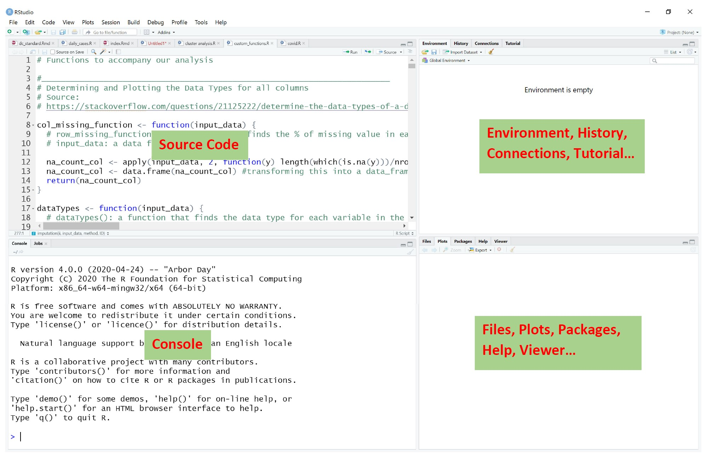
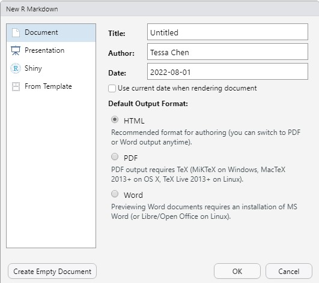

  
```{r setup, include=FALSE}
knitr::opts_chunk$set(echo = TRUE,
                      cache = TRUE,
                      cache.lazy = TRUE,
                      out.width = "100%",
                      warning = FALSE,
                      message = FALSE,
                      progress = FALSE,
                      verbose = TRUE)
```

## What is R?

<head>
    <base target="_blank">
</head>

[R](https://www.r-project.org/) is a statistical programming language. Developed by statisticians Ross Ihaka and Robert Gentleman, R is one of the most popular programming languages in the industry. It is used in almost everywhere, ranging from finance and banking to medicine and manufacturing. It can be used in disciplines like statistics, computer science, economics and economic modelling, cyber security, information systems, health care, engineering and so on.


To update R, run the following code. 

```{r Rupdate, eval=FALSE}
# Install installr (if not already installed)
if(require(installr)==FALSE) install.packages("installr") 

# using the package
require(installr)

# update R to the latest version
updateR()
```

## RStudio

[RStudio](https://www.rstudio.com/products/rstudio/) is an integrated development environment (IDE) for R. 

:::::: {style="display: flex;"}

::: {.column width=20%}
\ 
:::

::: {.column width=60%}

```{r rstudio, echo=FALSE, fig.align = 'center'}
   
```
:::

::: {.column width=20%}
\ 
:::
::::::


## What is R markdown?

R Markdown is a file format for creating dynamic documents with R and RStudio. RMarkdown documents are written in Markdown which has easy-to-write plain text format with embedded R code.

:::::: {style="display: flex;"}

::: {.column width=55%}

In order to create a Rmarkdown document, we click <span Style="color:#3384FF">File</span> and then find <span Style="color:#3384FF">New File</span>, <span Style="color:#3384FF">R markdown ...</span>, and <span Style="color:#3384FF">Document</span>. There are three options:

- HTML 
- PDF (Its output requires TeX.)
- Word (It requires an installation of MS Word.)

:::

::: {.column width=5%}
\ 
<!-- an empty Div (with a white space), serving as
a column separator -->
:::

::: {.column width=40%}

```{r rmarkdown, echo=FALSE, fig.align = 'center', out.width="90%"}
   
```

:::
::::::

## An Overview of R Markdown Documents

In the following, we show an example of the header of a R markdown file. 

```{r rmd_setting, echo=FALSE, fig.align = 'center', out.width="25%"}
   knitr::include_graphics('../Figures/rmd_setting.jpg')
```

We can use the output option to manipulate which document we would like to have. 

- html_document
- pdf_document
- word_document

To render a R Markdown document into its final output format, we can click the <span Style="color:#3384FF">Knit</span> button to render the document in RStudio and RStudio will show a preview of it. The corresponding output file is saved in the folder where the markdown file is. 

The further settings for presentations could be found at [R Markdown Cookbook](https://bookdown.org/yihui/rmarkdown-cookbook/) and [R Markdown: The Definitive Guide](https://bookdown.org/yihui/rmarkdown/pdf-document.html#figure-options-1).

## Typical R File Formats

- `.R` or `.r`: This is the standard file extension for R scripts. 

- `.RData` or `.rda`: These files store R objects in a serialized format. We can save workspace in R using the `save()` function or at the end of an R session. These objects can be reloaded into an R session using the `load()` function.

- `.Rds`: This is a file format for storing a single R object. Objects can be saved in this format using the `saveRDS()` function and read back using `readRDS()`.

- `.Rproj`: This is specific to RStudio, an Rproj file marks the root of an RStudio project and stores settings related to that project.

- `.Rmd`: R Markdown files. 

- `.Rnw`: This is a mix of LaTeX (for math equations) and R used for creating dynamic reports. 

- `.Rhistory`: This file stores the command history for an R session, allowing users to revisit or re-run previous commands.

- `.Rprofile`: This is a script that runs every time R starts. It is often used to set session-wide options or load specific libraries on startup.


## Some Useful Keyboard Shortcuts

:::::: {style="display: flex;"}

::: {.column width=50%}

- **Ctrl-A** to select all items
- **Ctrl-C** to copy
- **Ctrl-F** to find text in a page
- **Ctrl-N** to start a new file in an editor
- **Ctrl-O** to open a file from the disk
- **Ctrl-S** to save
- **Ctrl-T** to open a new tab in a browser
- **Ctrl-V** to paste
- **Ctrl-X** to cut
- **Ctrl-Z** to undo
- **Alt-Tab** changes from window to window.  
- **Alt-=** to insert a new equation in MS Word

:::

::: {.column width=50%}

- **Command-C** to copy
- **Command-F** to find text in a page
- **Command-N** to open a new Finder window
- **Command-O** to open a file from the disk
- **Command-S** to save
- **Command-V** to paste
- **Command-X** to cut
- **Command-Z** to undo
- **Command-Tab** changes from window to window.  
- **Ctrl-=** to insert a new equation in MS Word

See [Mac keyboard shortcuts](https://support.apple.com/en-us/HT201236) for more detail. 
:::

::::::

## Where to get help

1. To see documentation on any **function** in R, execute `?data.frame` etc.
2. Google it! (Better way to learn coding!)
3. Ask questions online, for example: [stackoverflow.com](https://stackoverflow.com/questions/tagged/r).

    How about some online chatbots such as <span class="blue">ChatGPT</span> or <span class="blue">Google Bard</span>?
    - When could we use it, or should we not use it?


## README

You can utilize the following single character keyboard shortcuts to enable alternate display modes (@xie2018r):

* A: Switches show of current versus all slides (helpful for printing all pages)

* B: Make fonts large

* c: Show table of contents

* S: Make fonts smaller


