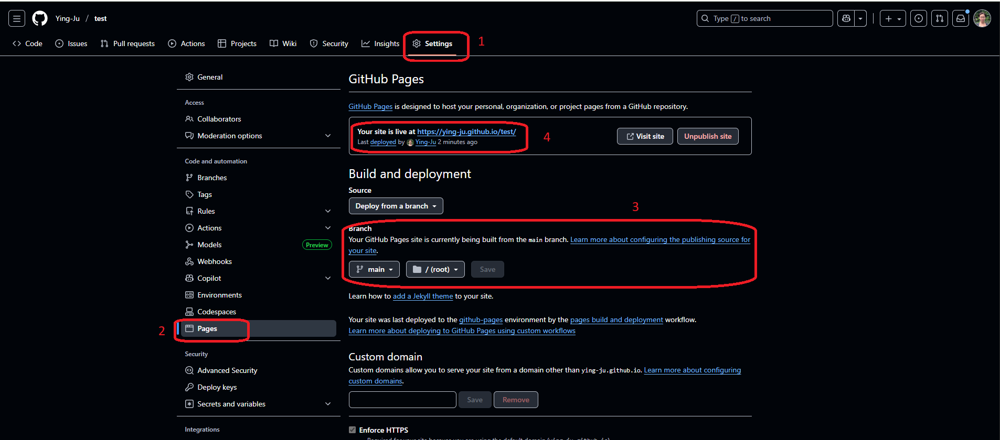

  
```{r setup, include=FALSE}
knitr::opts_chunk$set(echo = TRUE,
                      cache = TRUE,
                      cache.lazy = TRUE,
                      out.width = "100%",
                      warning = FALSE,
                      message = FALSE,
                      progress = FALSE,
                      verbose = TRUE)
```

## Overview

In this session, we will provide a quick overview of GitHub. It will cover some basic usages of GitHub Desktop due to the time limitation of the class. 

<head>
    <base target="_blank">
</head>


### What is Git?

Git is a version control system that allows us to track changes in any set of files. It is typically used by programmers who are working on source code together. 


### What is GitHub?

GitHub is a version control and collaboration tools for programming. It allows us to collaborate on projects from any location with other people. 


## Register for a GitHub account

We can register for a GitHub account at [www.github.com](https://github.com/){target="_blank"}.

```{r github, echo=FALSE, fig.align='center', out.width = "50%"}
knitr::include_graphics("../Figures/GitHub.JPG")
```


## Install and Set up GitHub Desktop

```{r github_desktop, echo=FALSE, fig.align='center', fig.cap="Installing GitHub Desktop from https://github.com/apps/desktop", out.width = "50%"}
knitr::include_url("https://github.com/apps/desktop", height = "600px")
```

## GitHub

We will create a process that shows how to create a repository, track changes, and explore a file's history. 


```{r github_home, echo=FALSE, fig.align='center', out.width = "80%"}
knitr::include_graphics("../Figures/GitHub_home.JPG")
```

## GitHub Desktop

::::::{style="display: flex;"}
:::{.column width=50%}

Here is an example that shows how GitHub Desktop looks like. 

```{r github_desktop_example, echo=FALSE, fig.align='center', out.width = "80%"}
knitr::include_graphics("../Figures/GitHub_desktop.JPG")
```

:::
:::{.column width=50%}

- Current repository
- Current branch
- Fetch origin

Fetch downloads the most recent updates from origin but it does not update our local working copy with the changes. After we click Fetch origin, the button changes to Pull Origin. Clicking Pull Origin will update our local working copy with the fetched updates.

- Summary (required) & Description (optional)
- Commit to master

When we commit the changes, the list of uncommitted changes was gone from the left pane. We have, however, just committed the changes locally. The commit must be pushed to the remote (origin) repository.
:::
::::::

## Use GitHub Pages to Publish HTML Files

::::::{style="display: flex;"}
:::{.column width=60%}

```{r github_desktop_pages, echo=FALSE, fig.align='center'}

```

:::
:::{.column width=40%}

1. Sign in our GitHub account at [www.github.com](https://github.com/).
2. Navigate to the repository where the HTML file is. You can have multiple HTML files in the same repository. 
3. Click <span Style="color:#3384FF">Settings</span> and find <span Style="color:#3384FF">Pages</span> from the left menu.
4. Under "GitHub Pages", use the None or Branch drop-down menu and select a publishing source.
5. Click <span Style="color:#3384FF">Save</span>.

The webpage is available at 

```
https://username.github.io/repository/folder/filename.html.
```

For example, the file Lesson1.html is in the folder <span Style="color:orange">examples</span> in the
GitHub repository <span Style="color:red">test</span>. The webpage for this lesson is

https://ying-ju.github.io/test/examples/Lesson1.html.  


**Note:** It may take a few minutes to have the webpage available online, depending on the HTML file size.  
:::
::::::


## README

You can utilize the following single character keyboard shortcuts to enable alternate display modes (@xie2018r):

* A: Switches show of current versus all slides (helpful for printing all pages)

* B: Make fonts large

* c: Show table of contents

* S: Make fonts smaller


