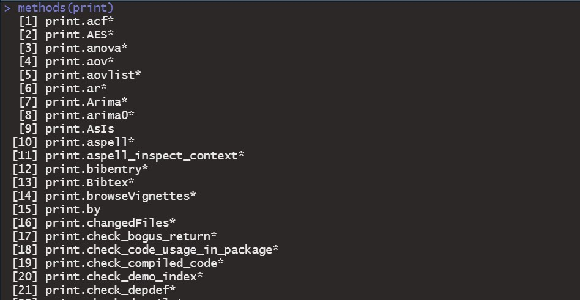

  
```{r setup, include=FALSE}
knitr::opts_chunk$set(echo = TRUE,
                      cache = TRUE,
                      cache.lazy = TRUE,
                      out.width = "100%",
                      warning = FALSE,
                      message = FALSE,
                      progress = FALSE,
                      verbose = TRUE)
```

## 4 Principles of Object-Oriented Programming

<head>
    <base target="_blank">
</head>

R is a functional programming language. However, R environment includes some support for object-oriented programming (OOP). Thus, R could be considered as an object-oriented language as it is based on the concept of "objects". It can contain data and code. Many programmers believe that object-oriented programming can help us write clear and reusable code. 

The four principles of object-oriented programming (OOP) are 
abstraction, encapsulation, inheritance, and polymorphism.

- Everything you touch in R is an object. 

- Abstraction: Objects should only reveal internal mechanisms relevant for the use of other objects.

- Encapsulation: All information is contained inside an object, and only selected information is exposed. It helps you keep track of related variables, enhancing clarity.

- Inheritance: Classes can reuse code from other classes by designing relationships between them. This allows to extend a given class to a more specialized class.

- Polymorphism: Objects can take more than one form. It promotes reusability.

In this session, we will introduce two types of classes, S3 and S4. 

**Note:** This lesson is based on the book: The Art of R Programming (@matloff2011art). 

## S3 Classes - 1

Most of R's own built-in classes are of the S3 type. An S3 class consists of a list, with a class name attribute and dispatch capability added. 

The functions that work with polymorphism, such as <span Style="color:blue">plot()</span>and <span Style="color:blue">print()</span>,
are known as generic functions. When a generic function is called, R will dispatch the call to the proper class method, meaning that it will reroute the
call to a function defined for the object's class. Let's use the <span Style="color:blue">lm()</span> as an example. 

```{r oop_lm}
x <- 1:100
y <- 2*x + rnorm(100, 1, 10)
lm_model <- lm(y~x)
class(lm_model)
lm_model
```

R interpreter found that lm_model was an object of class "lm" and then called <span Style="color:blue">print.lm()</span>, a special print method for the "lm" class. 


## S3 Classes - 2

Let's take a look at the generic function <span Style="color:blue">print()</span> and the class method in this case.

```{r print}
print
```

We can see that <span Style="color:blue">print()</span> consists solely of a call to <span Style="color:blue">UseMethod()</span>, which is the dispatcher function. The printing depends on context, with a special print function called for the
"lm" class. 

## S3 Classes - 3

We can find all the implementations of a given generic method by calling
<span Style="color:blue">methods()</span>, like this:

```{r methods, eval=FALSE}
methods(print)
```

```{r methods_print, echo=FALSE, fig.align = 'center', out.width="60%"}
   
```

## S3 Classes - 4

Asterisks denote non-visible functions, meaning ones that are not in the
default namespaces. You can find these functions using the <span Style="color:blue">getAnywhere()</span> function and then access them by using a namespace qualifier. 

```{r getanywhere}
getAnywhere(print.lm)
```

```{access_function}
stats:::print.lm(lm_model)
```
You can see all the generic methods using the command <span Style="color:blue">methods(class="default")</span>.

## Writing S3 Classes - 1

S3 class has no formal, predefined definition. In general, a list with its class attribute set to some class name, is an S3 object. Here we show how to define a function that will create and return an object of a given class. 

```{r s3class}
info <- list(name = "Tessa", degree = "PhD", phone = 92405)
class(info) <- "instructor"
attributes(info)
```

Before we write a print method for this class, let's see what happens when we call the default <span Style="color:blue">print()</span>.

```{r default}
info
```

## Writing S3 Classes - 2

Let's write our own print method. 

```{r print_instructor}
print.instructor <- function(obj){
  cat(obj$name, "\n")
  cat("Degree: ", obj$degree, "\n")
  cat("UD Phone No:", obj$phone, "\n")
}
```

Now, any call to <span Style="color:blue">print()</span> on an object of class "instructor" should now be referred to <span Style="color:blue">print.instructor()</span>. 

```{r print_instructor1, eval=FALSE}
info
```

```{r print_instructor2, echo=FALSE}
print.instructor(info)
```

## Writing Our Own Generic Function 

It is possible to make our own generic function like <span Style="color:blue">print()</span> or <span Style="color:blue">plot()</span>. 

For the sake of example, we make a new generic function called contact.

```{r generic}
contact <- function(obj){
  UseMethod("contact")
}
```

A generic function is useless without any method. Let us implement the default method.

```{r contact_default}
contact.default <- function(obj){
  cat("This is a generic function.\n")
}
```
Now let us make method for our class "instructor". 

```{r contact_instructor}
contact.instructor <- function(obj){
  cat(obj$name, "can be reached via", obj$phone, "\n")
}

contact(info)
```


## S4 Classes

S4 classes were developed later, with goal of adding safety, meaning that we cannot accidentally access a class component that is not already in existence. 


The following table shows an overall of the differences between the two classes. 

```{r echo=FALSE, }
df <- data.frame(Operation = c("Define class", "Create object", "Reference member variable", "Implement generic f()", "Declare generic"), S3 = c("Implicit in constructor code", "Bulid list, set class attr", "$", "Define f.classname()", "UseMethod()"), S4 = c("setClass()", "new()", "@", "setMethod()", "setGeneric()"))

knitr::kable(df)
```

## Writing S4 Classes - 1

We define an S4 class by calling <span Style="color:blue">setClass()</span>. Continuing our instructor example, we can use the following code to define a new class, "instructor", with three variables of specified types. 

```{r S4}
setClass("instructor",
         representation(
           name = "character", 
           degree = "character", 
           phone = "numeric"
         )
)
```

Now let's create an instance of this class, for Tessa, using <span Style="color:blue">new()</span>

```{r Tessa}
tessa <- new("instructor", name = "Tessa", degree = "PhD", phone = 92405)
tessa
```

## Writing S4 Classes - 2

We note that the member variables are called *slots*, referenced via the @ symbol. 

```{r Tessa_degree}
tessa@degree
slot(tessa, "degree")
tessa@phone <- 12345
```

As noted, an advantage of using S4 is safety. Suppose we were to accidentally spell *phone" as "pone". We can find that R will return an error message. By contrast, in S3 there would be no error message. S3 classes are just lists, and we are allowed to add a new component at any time. 

```{r pone, error=TRUE}
tessa@pone <- 92405
```

## Implementing a Generic Function on an S4 Class

We use <span Style="color:blue">setMethod()</span> to define an implementation of a generic function on an S4 class. Let's do that for our class "instructor" here. We will implement the <span Style="color:blue">show()</span> function, which is the S4 analog of S3's generic "print". 

```{r show}
show(tessa)
```

Let's override that, with the following code.

```{r show_instructor}
setMethod("show", "instructor",
          function(obj){
            cat(obj@name, "can be reached via", obj@phone, "\n")  
          }
)
tessa
```

The first argument gives the name of the generic function for which we will define a class-specific method, and the second argument gives the class name. Then we define a new function. 


## Managing Our Objects - 1

There are various tools that can help to manage objects. Here are some useful functions. 

- The <span Style="color:blue">ls()</span> function: listing our objects

```{r objs}
ls()
ls(pattern="te")
```
- The <span Style="color:blue">rm()</span> function: remove specific objects 

```{r rm}
rm(tessa)
rm(list = ls())
```

## Managing Our Objects - 2

- The <span Style="color:blue">save()</span> function: saving a collection of objects

```{r save1, fig.show='hide'}
x <- rnorm(1000, 100, 10)
hx <- hist(x)
save(hx, file = "histogram_file")
ls()
rm(hx)
ls()
```

## Managing Our Objects - 3

```{r save2, fig.align='center', out.width="30%"}
load("histogram_file")
ls()
plot(hx)
```

We use the <span Style="color:blue">save()</span> function to save the object of class "histogram" to the file *histogram_file*. The object can be reloaded in that future session via <span Style="color:blue">load(). 


## Managing Our Objects - 4

Here we introduce some useful functions that help us to know the structure of an object. 

- The <span Style="color:blue">class()</span> function: checking the class of an object 
- The <span Style="color:blue">mode()</span> function: checking the storage mode of an object
- The <span Style="color:blue">names()</span> function: getting the names of an object 

```{r names}
names(iris)
```

- The <span Style="color:blue">attributes()</span> function: getting the object attribute lists

```{r attributes}
x <- cbind(a = 1:3, pi = pi) # simple matrix with dim names
attributes(x)
```


## Managing Our Objects - 5

- The <span Style="color:blue">unclass()</span> function: returning its argument with its class attribute removed 

- The <span Style="color:blue">str()</span> function: displaying the structure of an object

- The <span Style="color:blue">edit()</span> function: invoking a text editor on an object

- The <span Style="color:blue">exists()</span> function: checking whether the argument exists

```{r}
exists("hello")
exists("iris")
```


## README

You can utilize the following single character keyboard shortcuts to enable alternate display modes (@xie2018r):

* A: Switches show of current versus all slides (helpful for printing all pages)

* B: Make fonts large

* c: Show table of contents

* S: Make fonts smaller


