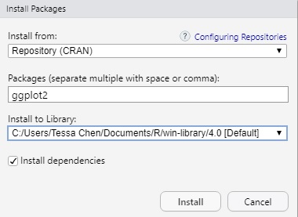

  
```{r setup, include=FALSE}
knitr::opts_chunk$set(echo = TRUE,
                      cache = TRUE,
                      cache.lazy = TRUE,
                      out.width = "100%",
                      warning = FALSE,
                      message = FALSE,
                      progress = FALSE,
                      verbose = TRUE)
```

## Installing and Loading Packages - 1

<head>
    <base target="_blank">
</head>


The commonly used units that people adopt to share code in R are packages. In general, a package contains code, data, documentation, tests, etc. Most people upload their packages to [CRAN](https://cran.r-project.org/){target="_blank"}, a comprehensive R Archive Network while a few people share their code on [GitHub](https://github.com/){target="_blank"} or other web sites.  It is recommended that you ONLY download packages from CRAN since these packages are well-maintained. 

:::::: {style="display: flex;"}

::: {.column width=40%}

In order to import packages in RStudio, you need to 

1. know the name of the package.

2. download the package. Here, we introduce two basic methods:
    - In the Console window, run **install.packages("package's name")**. 
  
**Note:** It is essential to put the quotation marks around the package's name.

:::

::: {.column width=60%}
- Click the **Packages** tab in RStudio (bottom right window) and then click <span style="color:blue">Install</span>, find <span style="color:blue">Install From:</span> and select <span style="color:blue">Repository (CRAN)</span>, type the name of the package in the box under **Packages (separate multiple with space or comma)** and click <span style="color:blue">Install</span>. 
  
```{r cran, echo=FALSE, fig.align = 'center', out.width = "45%"}
   
```

**Note:** we should leave **Install dependencies** checked so R will download any additional packages needed in order to use some functions or data in the package you are currently downloading. 
:::

::::::

## Installing and Loading Packages - 2

3. Use <span style="color:blue">library()</span> or <span style="color:blue">require()</span> function to import the package you would like to use.  Here, we show how to install the package <span style="color:red">tidyverse</span> which is designed for data science and how to import it.  

```{r packages, eval=FALSE}
install.packages("tidyverse")
library(tidyverse)
```

**Note:** 

  1. Sometimes, warning messages are given in the Console when installing certain packages indicating that the package was built using an older version of R.  In general, these warnings can be ignored since they are still compatible with newer versions of R.
  
  2. You only need to install a package once when the first time you need it. You can always import the package after you install it. 
  
  3. The main difference between library() and require() functions is library() returns an error if the package doesn't exist while require() returns FALSE and gives a warning. 

## Importing Data and Writing Files - 1

In this section, we introduce two methods of importing data from some commonly used formats and write files.

1. Using the <span style="color:blue">Import Dataset</span> tab in RStudio (on the top right window).

```{r readdata, echo=FALSE, fig.align = 'center', out.width="65%"}
   knitr::include_graphics('../Figures/readdata.jpg')
```

## Importing Data and Writing Files - 2

2. Using the code. Since there are many file types, we will focus on two commonly used file types: text files and comma separated value files. We will use the package <span style="color:red">readr</span> which is included in <span style="color:red">tidyverse</span> as it provides a fast and convenient way to read rectangular data (e.g. csv, tsv, and fwf). [readr](https://readr.tidyverse.org/) supports the following file types using the following functions to read files:

|             - read_csv(): comma separated (CSV) files
|             - read_csv2(): semicolon separated files
|             - read_delim(): general delimited files
|             - read_fwf(): fixed width files
|             - read_log(): web log files
|             - read_table(): tabular files where columns are separated by white-space.
|             - read_tsv(): tab separated files

|           Some Common arguments in these functions: 
|               - file: can be either a path to a file, a connection, or literal data
|               - col_names: can be either TRUE, FALSE, or a character of column names


**Note:** A CSV (comma-separated values) file is a <span Style="color:red">text</span> file in which information is separated by commas.

In general, these functions will work well.  We include the path to a file, and we will obtain a tibble which is a modern reimagining of the data frame.  It is much easier to navigate, view, and manipulate the contents of data using a tibble as every row is corresponding to an observation and every column is corresponding with a variable.

## Importing Data and Writing Files - 3

The following code chunk gives an example of reading a data file. 

```{r obtaindata1}
library(tidyverse)
ds_salaries <- read_csv("G:/Shared drives/UD Statistics Course Materials/MTH 209/brainstorming activities/datasets/ds_salaries.csv")
head(ds_salaries) # use head() to read the first six rows of the data
```


## Importing Data and Writing Files - 3

- Use the <span Style="color:blue">glimpse()</span> function to get a glimpse of data

```{r read1}
glimpse(ds_salaries) # use glimpse() to get a glimpse of the data
```

**Note:** <span Style="color:blue">glimpse()</span> is a function included in <span Style="color:red">tidyverse</span>.

## Importing Data and Writing Files - 4

We can read the data available online as well. Here, we use a dataset [Electric Vehicle Population Data](https://catalog.data.gov/dataset/electric-vehicle-population-data) available on [DATA.GOV](https://data.gov/)

```{r read2}
vehicle <- read_csv("https://data.wa.gov/api/views/f6w7-q2d2/rows.csv?accessType=DOWNLOAD")

glimpse(vehicle)
```

**Note:** You may see the single quotes are included in some names of variables. This is because there is at least one space included in the name. 

**Question:** If we want to remove the single quotes in the names of variables, what could be possible solution?

## Importing Data and Writing Files - 5

The second data file could be queried from [CDC WONDER](https://wonder.cdc.gov/ucd-icd10.html).


```{r obtaindata2}
CDC_Death <- read_tsv("../Data/Underlying Cause of Death.txt")
glimpse(CDC_Death)
```

**Note:** In many programming languages like C, C++, Java, MatLab, Python, Perl, R, a backslash, \\, works as an escape character in strings.  So in these languages, we need to use either slash, /, or double backslash, \\\\, in the string in order to get a single backslash for a path. 

## Importing Data and Writing Files - 6

Similarly, [readr](https://readr.tidyverse.org/reference/write_delim.html){target="_blank"} provides the following functions to write files:

|       - write_csv(): comma separated (CSV) files
|       - write_csv2(): semicolon separated files
|       - write_delim(): general delimited files
|       - write_excel_csv
|       - write_excel_csv2
|       - write_tsv: tab separated files

Some Common arguments in these functions: 

|       - x: a data frame 
|       - path: Path or connection to write to (including the file name).
|       - delim: delimiter used to separate values.
|       - na: string used for missing values. Defaults to NA.
|       - append: if FALSE, the function overwrites existing file. If TRUE, it appends to existing file. A new file will be created if the file does not exist.
|       - col_names: If TRUE, write columns names at the top of the file.

We can save the CDC wonder data to a CSV file. 

```{r writedata, eval=FALSE}
write_csv(CDC_Death, "C:/Users/ychen4/Dropbox/MTH 209/Class Handouts/Data/data/name_of_file.csv")
```

## README

You can utilize the following single character keyboard shortcuts to enable alternate display modes (@xie2018r):

* A: Switches show of current versus all slides (helpful for printing all pages)

* B: Make fonts large

* c: Show table of contents

* S: Make fonts smaller


